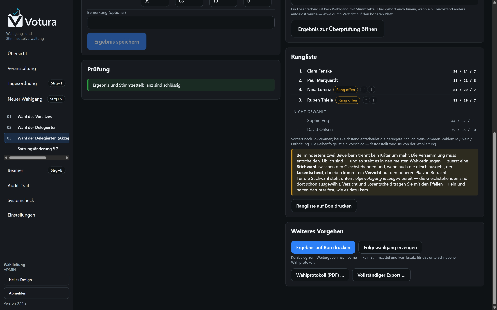
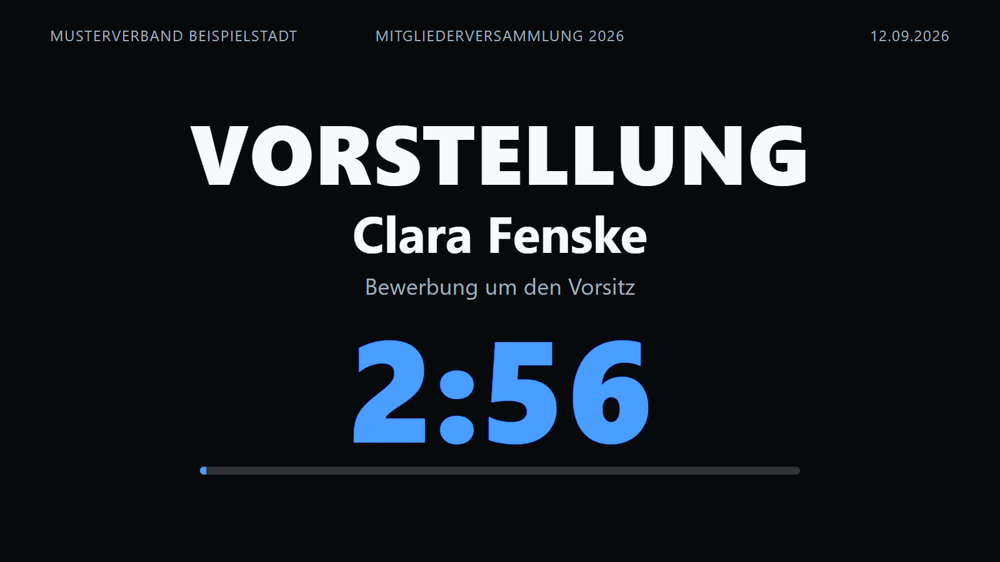
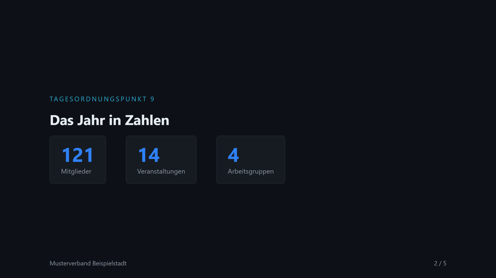
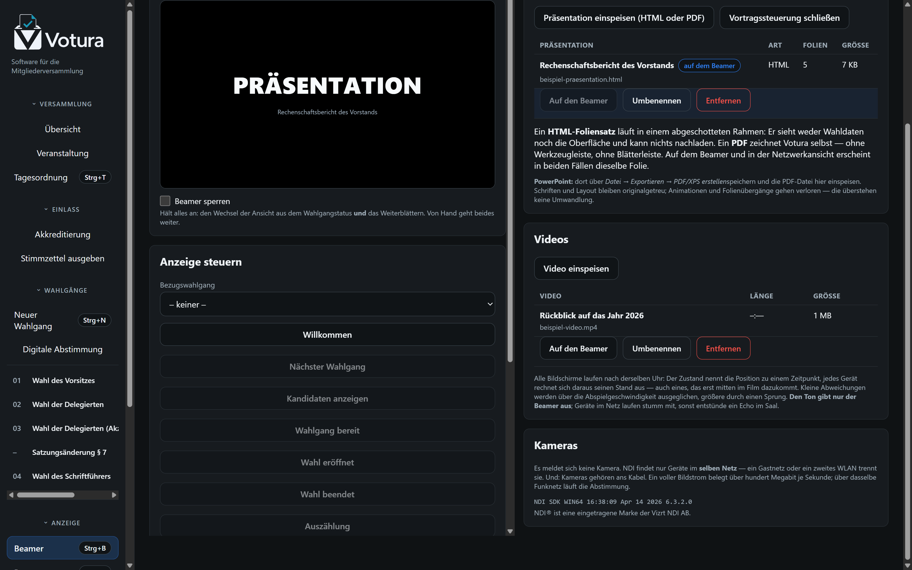
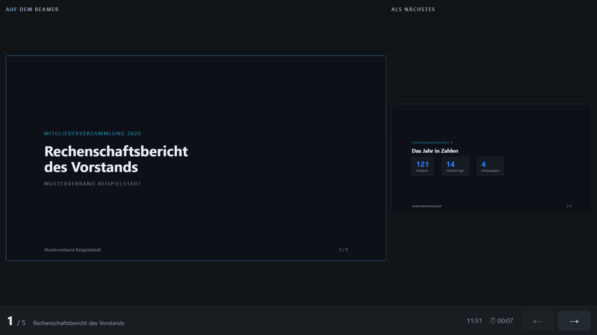
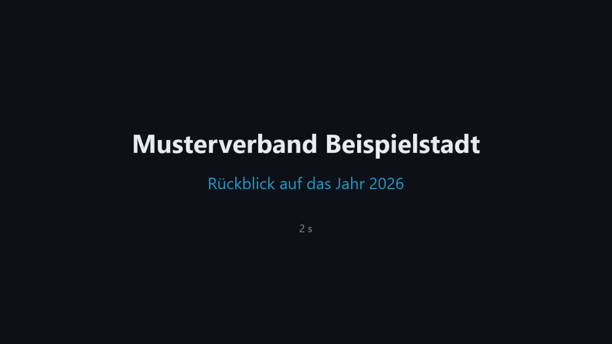
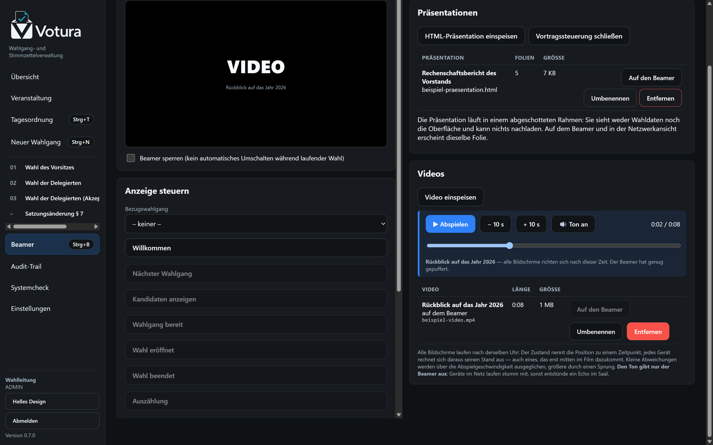

<p align="center">
  
  
</p>


**Software für die Mitgliederversammlung.** Wahlgänge, Stimmzettel, Beamer und Pult — vollständig
offline auf einem Rechner.

Votura begleitet eine Versammlung von der Tagesordnung bis zum Ergebnis an der Wand: Es bereitet
Wahlgänge vor, druckt die Stimmzettel auf Thermodruckern, führt die Auszählung, stellt das Ergebnis
fest — und bespielt dabei bis zu vier Anzeigeflächen im Saal mit Kandidatenlisten, Foliensätzen,
Filmen und Redezeituhren. Wer vorn steht, liest am Teleprompter, der auf Wunsch mithört und dem
Gesprochenen folgt.

> **Das System ist kein elektronisches Wahlsystem.** Die Stimme existiert ausschließlich auf dem
> anonymen Papier-Stimmzettel. Die Software kennt Wahlgang, Kandidaten, Stückzahlen und Ergebnis —
> sie kennt **nicht**, wer welchen Stimmzettel ausgefüllt hat.


## Überblick

| Bereich | Umsetzung |
|---|---|
| Plattform | Electron 43 (Chromium + Node 24), React 19, TypeScript |
| Datenhaltung | SQLite über `node:sqlite` (WAL), lokal im Benutzerprofil |
| Druck | ESC/POS; Epson ePOS-Print (LAN/XML), RAW-Netzwerk (9100), Windows-Spooler (USB), Dateiausgabe |
| Bühnen | Bis zu vier Anzeigeflächen, je eigenes Fenster und eigene Netzadresse, gemeinsam schaltbar |
| Beamer | Rein lesende Fenster + optionale Netzwerkansicht im Browser |
| Präsentationen | Eingespeiste HTML-Foliensätze und PDF (z. B. aus PowerPoint), Vortragssteuerung in eigenem Fenster |
| Video | MP4/WebM gleichzeitig auf allen Bildschirmen, nach gemeinsamer Uhr |
| Teleprompter | Reden als Markdown, eigener Netzendpunkt, Spiegelung, Mitlaufen nach Gehör |
| Ergebnis | Rangliste nach Verfahrensregeln, offene Ränge werden benannt statt geraten |
| Betrieb | Vollständig offline: keine Cloud, keine Telemetrie, keine externen Schriften |
| Begleitanwendung | **Votura Saal** — findet den Hauptrechner selbst, wird Bühne oder Pult |
| Installation | Windows: Installer (NSIS) und portable Fassung · Linux: `tar.gz` für x64 und arm64 |
| Raspberry Pi | Pi 4/5 als Anzeigegerät: ein Befehl richtet Kiosk und Neustart nach Absturz ein |

## Herunterladen

Fertige Windows-Fassungen liegen unter [Releases](../../releases):

- `Votura-<version>-x64-Setup.exe` — Installer
- `Votura-<version>-x64-portable.exe` — ohne Installation lauffähig

Die Dateien sind nicht signiert; Windows SmartScreen meldet sich daher beim ersten Start
(„Weitere Informationen" → „Trotzdem ausführen").

## Schnellstart (Entwicklung)

```bash
npm install
npm run dev          # Anwendung mit Hot Reload starten
npm test             # 134 Unit- und Integrationstests
npm run typecheck    # Typprüfung für Main-, Preload- und Renderer-Code
npm run build        # Produktionsbundle nach out/
npm run dist:win     # Windows-Installer und portable EXE nach release/
```

Die Installationsdateien liegen anschließend unter `release/`:

- `Votura-<version>-x64-Setup.exe` — Installer mit Desktop- und Startmenü-Verknüpfung
- `Votura-<version>-x64-portable.exe` — ohne Installation lauffähig (z. B. vom USB-Stick)

## Ablauf einer Versammlung

```
Veranstaltung anlegen → Wahlgang (Wizard) → Kandidaten → Liste schließen →
Druckvorschau → Prüfliste → Freigabe → Massendruck → Stimmabgabe auf Papier →
manuelle Auszählung → Ergebnis erfassen → Feststellung bestätigen → Wahlgang abschließen
```

Die Beameransicht folgt diesen Schritten automatisch; Ergebnisse erscheinen dort erst nach
ausdrücklicher Bestätigung durch die Wahlleitung.

<table>
<tr>
<td width="50%"><br><sub><b>Kandidaten</b> — erfassen, sortieren, nummerieren; die Liste wird vor der Freigabe geschlossen.</sub></td>
<td width="50%"><br><sub><b>Stimmzettel</b> — zeichengetreue Vorschau des Bons, Prüfliste und Freigabe mit SHA-256-Hash.</sub></td>
</tr>
<tr>
<td width="50%"><br><sub><b>Druck</b> — Stückzahl, Drucker und Testdruck; jeder Auftrag wird protokolliert.</sub></td>
<td width="50%"><br><sub><b>Ergebnis</b> — Auszählung erfassen, Plausibilität prüfen, Feststellung durch die Wahlleitung.</sub></td>
</tr>
</table>

## Wahlverfahren

Wahlzweck (`purpose`) und Wahlverfahren (`procedure`) sind strikt getrennt: Aus „Delegiertenwahl"
folgt kein Verfahren — das beschließt die Versammlung. Dieselbe Delegiertenwahl kann als
Gruppenwahl, als Akzeptanzwahl oder in zwei Stufen durchgeführt werden; der Stimmzettel sieht
jeweils anders aus.

### Personenwahlen

| Verfahren | Stimmzettel | Wofür |
|---|---|---|
| **Einzelwahl – ein Kandidat** | ein Name, global `JA` / `NEIN` / `ENTHALTUNG` | Eine Position, ein Bewerber |
| **Einzelwahl – mehrere Kandidaten** | alle Namen, eine Stimme, dazu `NEIN` / `ENTHALTUNG` | Eine Position, mehrere Bewerber |
| **Stichwahl** | die verbliebenen Bewerber, eine Stimme | Zweiter Durchgang ohne erreichte Mehrheit |
| **Verbundene Einzelwahl** | je Position ein eigener Abschnitt | Mehrere Positionen auf einem Zettel, getrennt entschieden |
| **Gruppenwahl – vorgedruckt** | alle Namen mit Ankreuzfeld, höchstens *n* Stimmen | Mehrere gleichartige Sitze, Bewerberfeld steht fest |
| **Gruppenwahl – Blanko** | nummerierte Schreiblinien | Mehrere Sitze, Namen werden handschriftlich eingetragen |
| **Akzeptanzwahl – Einzelposition** | `JA` / `NEIN` / `ENTHALTUNG` **je Bewerber** | Jeder Bewerber wird einzeln beurteilt |
| **Akzeptanzwahl – mehrere Positionen** | `JA` / `NEIN` / `ENTHALTUNG` **je Bewerber** | Gewählt ist, wer mehr Ja- als Nein-Stimmen hat |
| **Zwei-Stufen-Wahl – Stufe 1** | alle Namen, ohne feste Höchstzahl | Vorauswahl des Bewerberfelds |
| **Zwei-Stufen-Wahl – Stufe 2, Einzelplatz** | die Vorausgewählten, eine Stimme | Listenplatz für Listenplatz besetzen |
| **Zwei-Stufen-Wahl – Stufe 2, Wahlblock** | die Vorausgewählten, *n* Stimmen | Mehrere Listenplätze in einem Block |

### Sachabstimmungen

| Verfahren | Stimmzettel | Wofür |
|---|---|---|
| **Ja / Nein / Enthaltung** | Beschlusstext, drei Optionen | Anträge, Satzungsänderungen |
| **Eine von mehreren Optionen** | Optionen, eine Stimme | Auswahl zwischen Vorschlägen |
| **Mehrere Optionen** | Optionen, mehrere Stimmen | Zustimmung zu mehreren Punkten |
| **Variantenwahl / Alternativanträge** | Varianten, eine Stimme | Konkurrierende Anträge |
| **Offene Abstimmung** | **kein Stimmzettel** | Handzeichen oder Stimmkarte; nur Stimmen werden gezählt |

### Beispiel: dieselbe Delegiertenwahl in zwei Verfahren

Der Demo-Bestand enthält beide Fassungen — links die Gruppenwahl (ankreuzen, höchstens acht
Stimmen), rechts die Akzeptanzwahl (jeder Bewerber einzeln mit `JA` / `NEIN` / `ENTHALTUNG`).

<table>
<tr>
<td width="50%"><br><sub><b>Gruppenwahl</b> — ein Ankreuzfeld je Name, Nein und Enthaltung gelten für den ganzen Zettel und stehen am Ende.</sub></td>
<td width="50%"><br><sub><b>Akzeptanzwahl</b> — unter jedem Namen ein eigenes Votum; die Kopfzeile weist das Verfahren aus.</sub></td>
</tr>
<tr>
<td width="50%"><br><sub><b>Ergebnis</b> — Stimmen je Bewerber, Rangfolge und Sitzgrenze.</sub></td>
<td width="50%"><br><sub><b>Ergebnis</b> — Ja/Nein/Enthaltung je Bewerber. Wer nicht mehr Ja- als Nein-Stimmen hat, wird gekennzeichnet; hier bleibt der fünfte Platz unbesetzt.</sub></td>
</tr>
</table>

Zu jedem Verfahren gehören eigene Vorgaben für Höchststimmenzahl, Mindestzahl an Bewerbern, die
Frage, ob mehrere Sitze zu besetzen sind, und der Vorschlag für die Feststellung. Was auf dem
Zettel steht — `JA`, `NEIN`, `ENTHALTUNG`, Kandidatennummern, Kumulieren, Abstände —, bleibt je
Wahlgang einstellbar, weil es sich nach der geltenden Wahlordnung richtet und nicht nach der
Software.

## Ergebnis und Rangliste

Bei mehreren Plätzen ist die **Reihenfolge** das Ergebnis: Wer ist Delegierter, wer Ersatz, in
welcher Folge wird nachgerückt. Der Reiter *Ergebnis* zeigt sie als eigene Liste — erst die
Gewählten in ihrer Reihenfolge, dann eine Trennlinie, dann die Nichtgewählten.

Sortiert wird nach den Regeln des Verfahrens:

| Verfahren | Reihenfolge |
|---|---|
| Ankreuzen | nach Stimmen |
| Akzeptanzwahl | zuerst Ja-Stimmen, bei Gleichstand **weniger** Nein-Stimmen |

Wer bei gleicher Zustimmung weniger Ablehnung auf sich zieht, hat den größeren Rückhalt.
Enthaltungen bleiben außen vor — sie sind weder Zustimmung noch Ablehnung. Wer mehr Nein als Ja
hat, steht hinter der Trennlinie, auch wenn ein Platz frei bliebe.

### Wenn die Zahlen nicht mehr trennen

Liegen zwei Bewerber in allen Kriterien gleichauf, **rät die Anwendung nicht**. Sie sortiert nicht
heimlich nach dem Namen, sondern schreibt *Rang offen* an beide Zeilen. Die Versammlung
entscheidet — und alle drei üblichen Wege sind unterstützt:

1. **Stichwahl** zwischen den Gleichstehenden — über *Folgewahlgang erzeugen*; die
   Gleichstehenden sind dort vorausgewählt.
2. **Losentscheid**, wenn auch die gleich ausgeht. So sehen es die meisten Wahlordnungen vor, und
   so steht es im Bundeswahlgesetz (§ 6: „entscheidet das Los").
3. **Verzicht** auf den höheren Platz.

Für Verzicht und Losentscheid wird die Entscheidung mit **↑ ↓** eingetragen und im Ergebnis
festgehalten; das Feld *Losentscheid dokumentieren* nimmt auf, wie es dazu kam. Stehen mehrere
Gleichstände in einer Liste, bleibt jeder für sich offen, bis über ihn befunden wurde.

Die eingetragene Reihenfolge **hebt niemanden über die Zahlen hinweg** — sie zählt nur dort, wo
sonst nichts mehr trennt.



<sub><b>Rangliste</b> — Gewählte in ihrer Reihenfolge, darunter die Nichtgewählten. Rang 3 ist offen: Zwei Bewerber liegen in Ja- und Nein-Zahl gleichauf, die Pfeile tragen die Entscheidung der Versammlung ein.</sub>

### Ergebnisbeleg auf dem Bon

*Ergebnis auf Bon drucken* gibt denselben Aufbau auf dem Thermodrucker aus: Wahlbeteiligung,
Stimmen je Bewerber in der Rangfolge, Trennlinie, Feststellung, Gewählte, Unterschriftszeile. Zum
sofortigen Weitergeben nach vorne — unübersehbar als **kein Stimmzettel** gekennzeichnet und mit
dem Hinweis, dass das unterschriebene Wahlprotokoll verbindlich bleibt.

## Vorstellung mit Redezeit

Auf einer Versammlung stellen sich Bewerber nacheinander vor, oft mit begrenzter Zeit. Der Beamer
zeigt dafür **wer spricht** und **wie lange noch**: Name groß, darunter ein Zusatz wie „Bewerbung
um den Vorsitz", dazu die verbleibende Zeit mit Balken.

Die letzten dreißig Sekunden werden gelb. Danach zählt die Anzeige **ins Minus weiter** und wird
rot — wer überzieht, soll es sehen, und die Versammlungsleitung auch, ohne ihn unterbrechen zu
müssen.

Ist ein Bezugswahlgang gewählt, stehen dessen Bewerber zur Auswahl — abtippen entfällt. Für Gast,
Bericht oder Grußwort gibt es daneben ein freies Feld.

**Wer als Nächstes drankommt, steht mit auf der Folie.** Die Reihe ergibt sich aus der
Kandidatenliste, denn vorgestellt wird in der Reihenfolge des Stimmzettels — eine Warteliste zu
pflegen erübrigt sich. Wie viele Namen zu sehen sind, ist einstellbar; *Nächster* ruft die nächste
Person auf, die Reihe rückt nach und die Uhr beginnt von vorn. So bringen sich die Folgenden schon
in Stellung, statt erst beim Aufruf loszugehen.

Während der Vorstellung: **Anhalten/Weiter** für eine Zwischenfrage, **±1 Min.** für den üblichen
Zuruf, **±10 s** zum Nachjustieren kurz vor Schluss. Redezeit 0 zeigt nur den Namen, ohne Uhr.



<sub><b>Vorstellung</b> — Name, Anlass und die verbleibende Redezeit. Die letzten dreißig Sekunden werden gelb, danach zählt die Anzeige rot ins Minus weiter.</sub>

## Sicherheitszusagen (technisch durchgesetzt)

- **Kein Personenbezug:** Es existiert keine Datenstruktur, die eine Person mit einem Stimmzettel
  verbindet. Ausgabe, Ersatz und Rücknahme werden ausschließlich als Mengen dokumentiert.
- **Keine Einzelkennung:** Alle Stimmzettel eines Wahlgangs sind identisch und tragen dieselbe
  Wahlgangkennung — keine Seriennummern, keine Codes je Zettel.
- **Freigabe vor Druck:** Ohne freigegebene Version verweigert der Druckdienst den Auftrag.
- **Versionierung:** Jede druckrelevante Änderung nach der Freigabe erzeugt eine neue Version;
  die alte bleibt mit SHA-256-Hash archiviert.
- **Keine automatische Wiederholung:** Ein abgebrochener oder unklarer Druckauftrag wird nie
  automatisch neu gedruckt; die tatsächliche Menge wird physisch geprüft und dokumentiert.
- **Idempotenz:** Ein identischer Druckauftrag (Idempotency-Key) wird nicht doppelt ausgeführt.
- **Ehrliche Zählung:** Gezählt wird, was an den Drucker übermittelt wurde. „Physisch gedruckt"
  behauptet die Anwendung erst nach menschlicher Bestätigung.
- **Audit-Trail:** Append-only mit Hash-Kette; nachträgliche Änderungen werden erkannt.
- **Unveränderbarkeit:** Abgeschlossene Wahlgänge sind im normalen Betrieb gesperrt.
- **Beamer read-only:** Die Publikumsansicht besitzt keine Schreib-API und erhält nur reduzierte
  Anzeige-DTOs — keine IDs, Hashes oder internen Notizen.
- **Kein Selbstaktualisieren:** Die Anwendung lädt und installiert nichts von sich aus; die
  laufende Fassung bleibt die geprüfte Fassung.

## Nachvollziehbarkeit

<table>
<tr>
<td width="50%"><br><sub><b>Audit-Trail</b> — jede Handlung mit Zeit, Person und Begründung, als Hash-Kette gesichert.</sub></td>
<td width="50%"><br><sub><b>Systemcheck</b> — Drucker, Papier, Speicherplatz und Datenbank vor der Versammlung prüfen.</sub></td>
</tr>
</table>

## Drucker

Zielklasse: 80 mm, 203 dpi, Auto-Cutter, ESC/POS. Vier Anbindungen stehen zur Wahl:

1. **Epson ePOS-Print** (empfohlen bei Epson-Netzwerkgeräten): Epsons eigene XML-Schnittstelle über
   HTTP im LAN. Liefert als einzige Anbindung echten Gerätestatus (Papier, Abdeckung, Cutter).
2. **ESC/POS RAW** über Port 9100 für beliebige Netzwerk-Thermodrucker.
3. **Windows-Spooler (RAW)** für USB-Drucker mit installiertem Epson-Treiber.
4. **Dateiausgabe** als Ersatzweg ohne Drucker (Textfassung + ESC/POS-Rohdaten).

Alle Layoutparameter (Breite, Zeichen je Zeile, Zeichentabelle, Cutter, Vorschub) sind je Drucker
konfigurierbar.

## Beameransicht


Die Publikumsansicht kennt eigene Bilder für Begrüßung, Tagesordnung, Kandidatenvorstellung,
laufende Wahl, Auszählung, Ergebnis, Pause mit Countdown und freie Mitteilungen. Farben, Logo und
Schriftgröße sind einstellbar; lange Listen blättern seitenweise um, und die Anzeige misst nach
jedem Wechsel nach, ob alles ins Bild passt.

<table>
<tr>
<td width="50%"><br><sub><b>Steuerung</b> — Bild wählen, Vorschau, Netzwerkansicht und Sperre während laufender Wahl.</sub></td>
<td width="50%"><br><sub><b>Tagesordnung</b> — vorab anlegen, frei sortieren, Anträge dazwischenschieben.</sub></td>
</tr>
</table>

## Mehrere Bühnen

Eine Versammlung hat selten nur eine Wand. Votura verwaltet bis zu **vier Anzeigeflächen** — im
Haus **Bühnen** genannt —, jede mit eigenem Inhalt: vorn die Kandidatenliste, seitlich die laufende
Vorstellung mit Redezeit, im Foyer die Begrüßung.


- **Reiter über der Steuerung.** Alles darunter — Ansicht, Präsentation, Video, Pause, Redezeit —
  bezieht sich auf die dort gewählte Bühne. Es gibt keine zweite Stelle, an der man die Bühne
  einstellt, und keinen Regler, der versehentlich die falsche Wand trifft.
- **„Alle" als Master.** Derselbe Satz Knöpfe, aber auf allen Bühnen zugleich — „Pause" oder
  „Versammlung beendet" gehören überall hin. Die Vorschau zeigt dabei jede Wand einzeln; ein Modus
  wird nur dann hervorgehoben, wenn wirklich überall dasselbe läuft.
- **Folgt dem Wahlgang — oder eben nicht.** Je Bühne einstellbar. Ohne Haken bleibt eine Bühne
  stehen, bis sie von Hand umgeschaltet wird: für eine Rednerliste oder ein Standbild neben dem
  Wahlgeschehen. Die Hauptbühne folgt immer und lässt sich nicht abbauen.
- **Lokal und im Netz.** Ein zweites Beamerfenster wählt seinen Bildschirm wie das erste. Geräte im
  Netz wählen ihre Bühne über die Adresse: `/b/2` neben dem zweiten Beamer, und dort steht bis zum
  Schluss genau das, was hingehört. Die Adressen listet die Bedienung unter **Ausgabe & Netz** auf.
- **Die Vortragssteuerung folgt von selbst.** Sie zeigt die Bühne, auf der gerade ein Foliensatz
  läuft. Bei mehreren Bühnen liegt im Fuß des Fensters eine Auswahl.

## Teleprompter

Wer vorn steht, liest selten frei. Votura legt Reden als **Markdown** ab und zeigt sie am Pult —
im eigenen Fenster oder auf einem beliebigen Gerät über einen **eigenen Netzendpunkt**
(`/prompter`). Auf dem Beamer erscheint davon nichts.


- **Markdown, weil eine Rede Text mit Gliederung ist.** `#` wird zur Marke, `-` zur Aufzählung,
  `>` zum Zitat, `---` zu einer Stelle zum Durchatmen. Geschrieben wird in jedem Editor — oder
  gleich in Votura, auch noch während der Versammlung.
- **Der Lauf hängt an der Uhr,** nicht an fortlaufenden Befehlen: gespeichert sind die Stelle, der
  Zeitpunkt und das Tempo. Ein Gerät, das mitten in der Rede dazukommt, rechnet sich seinen Stand
  selbst aus.
- **In Zeilen gemessen, nicht in Pixeln.** Telefon, Tablet und Pultmonitor haben verschiedene
  Flächen — und stehen trotzdem an derselben Stelle im Text.
- **Spiegelung** waagerecht (für den Prompterspiegel) und senkrecht (Gerät hängt über Kopf),
  einzeln schaltbar; dazu Schriftgröße, Textbreite und die Höhe der Lesezeile.
- **Gesteuert vom Masterboard oder am Pult:** Leertaste hält an, Pfeile springen zeilenweise, `+`
  und `−` ändern das Tempo, `M` spiegelt. Dieselben Werte liegen in der Bedienung.
- **Die Redezeit der Vorstellung** lässt sich auf den Prompter holen — dann sieht die vortragende
  Person dieselbe Uhr wie der Saal.
- **Mitlaufen nach Gehör** (Laufart *Nach Stimme*): Der Prompter hört mit und setzt die Stelle
  dorthin, wo gesprochen wird. Vollständig auf dem Gerät — aufgenommen wird nichts, nach außen
  wandert allein eine Zahl. Ein kleines deutsches Sprachmodell liegt bei; ein größeres lässt sich
  in den Einstellungen darüberlegen.


## Votura Saal — die Begleitanwendung

Eine Bühne oder das Pult lässt sich mit jedem Browser im Saalnetz anzeigen. Sobald aber ein
**Mikrofon** dazukommt, ist Schluss: `getUserMedia` verlangt eine sichere Herkunft, und der
Projektionsserver spricht einfaches HTTP.

**Votura Saal** löst das — eine eigene, kleine Anwendung für die Geräte im Raum:

- **Sie findet den Hauptrechner selbst.** Beim Start ruft sie ins Netz; wer antwortet, steht zur
  Auswahl, mit Namen der Versammlung, Fassung und Bühnen. Niemand tippt eine IP-Adresse ab. Geht
  der Ruf nicht durch, bleibt das Feld für die Adresse von Hand.
- **Sie fragt, was sie sein soll:** Bühne 1 … 4 oder Prompter am Pult.
- **Sie führt genau diese eine Adresse als vertrauenswürdig** — damit steht dem Prompter das
  Mikrofon zur Verfügung und das Mitlaufen nach Gehör läuft auch auf einem Gerät im Saal. Die
  Zusage gilt einem Rechner, nicht dem Netz, und nur solange sie eingestellt ist.
- **Sie baut nichts nach.** Alles, was zu sehen ist, liefert der Hauptrechner; auch das
  Sprachmodell kommt von dort. Deshalb bleibt sie klein und muss nicht mitgepflegt werden.
- **Sie wartet, statt schwarz zu bleiben.** Läuft der Hauptrechner noch nicht, sagt sie, worauf
  sie wartet, und versucht es alle vier Sekunden erneut — der Regelfall beim Aufbauen.
- **Zurück in die Einrichtung: `Strg + Umschalt + E`.** Im Vollbild ist das der einzige Weg zurück,
  deshalb ist er an jedem Fenster fest verankert und steht zusätzlich im Fenstertitel.

### Auf einem Raspberry Pi

Ein Pi 4 oder 5 hinter dem Beamer ist das naheliegende Gerät dafür — lautlos, klein, und er kostet
weniger als ein Verlängerungskabel für HDMI. Ein Befehl macht ihn zum Anzeigegerät:

```bash
curl -fsSL https://www.getvotura.de/pi/install.sh | sudo bash
```

Danach bootet er ohne Anmeldung in Votura Saal: Vollbild, kein Desktop, kein Mauszeiger, kein
Bildschirmschoner. Stürzt die Anwendung ab, ist sie in drei Sekunden zurück; fällt der Strom aus,
kommt der Pi von selbst wieder. Einzelheiten in [`pi/README.md`](pi/README.md); wie daraus ein
flashbares Abbild entsteht, steht in [`pi/bauen.md`](pi/bauen.md).

**64 Bit ist Pflicht** — Electron unterstützt kein armv7 mehr. Raspberry Pi OS Lite (64 Bit)
genügt; ein Desktop wird nicht gebraucht.

Gebaut wird sie aus derselben Quelle (`npm run dist:saal`): Sie zeigt die Seiten des Hauptrechners
an, und zwei getrennte Projekte liefen unweigerlich auseinander.

## Präsentationen

Zwischen zwei Wahlgängen wird geredet — Rechenschaftsbericht, Kandidatenvorstellung, Ausblick.
Eine **einzelne HTML-Datei** lässt sich einspeisen und läuft dann im selben Beamerfenster und
derselben Netzwerkansicht wie die Wahlansicht; eine Schaltfläche bringt den Wahlgang zurück.

- **Bibliothek** — mehrere Foliensätze einspeisen, benennen, wechseln. Die Datei wird kopiert,
  nicht verknüpft: Der Stick, von dem sie kam, ist im Saal längst wieder in der Tasche.
- **Vortragssteuerung** — eigenes Fenster mit der laufenden Folie, der nächsten daneben,
  Position, Uhrzeit und Stoppuhr. Pfeiltasten, Leertaste, Bild auf/ab, Pos1/Ende.
- **Abgeschottet** — der Foliensatz läuft in einem Rahmen ohne Zugriff auf Wahldaten, Oberfläche
  oder Netz. Er kann nichts nachladen und nichts melden.
- **PowerPoint über PDF** — was in PowerPoint, Impress oder Keynote entsteht, kommt über deren
  eigenen PDF-Export herein. Votura zeichnet die Seiten selbst, ohne Werkzeug- und Blätterleiste.
  Layout und Schriften bleiben originalgetreu; Animationen gehen verloren.

Erwartet wird eine Datei, die alles mitbringt: Schriften, Bilder und Steuerung darin. Sie läuft
damit ohne Netz und ohne zweites Programm — und ohne Schriftarten, die auf dem Saalrechner fehlen
könnten.

<table>
<tr>
<td width="50%"><br><sub><b>Auf dem Beamer</b> — der Foliensatz füllt dieselbe Fläche wie die Wahlansicht; ein Klick schaltet zurück.</sub></td>
<td width="50%"><br><sub><b>Bibliothek</b> — eingespeiste Foliensätze mit Folienzahl und Größe; einer davon liegt auf dem Beamer.</sub></td>
</tr>
</table>



<sub><b>Vortragssteuerung</b> — links die Folie an der Wand, rechts die nächste, darunter Position, Uhrzeit und die Zeit seit Beginn. Beide Vorschauen rechnen mit der Fläche des Beamers und unterscheiden sich nur im Maßstab: Was hier steht, steht gleich auch dort.</sub>

**Wie so eine Datei aufgebaut sein muss**, steht in
**[docs/praesentationen.md](docs/praesentationen.md)** — mit der vollständigen, lauffähigen
Vorlage **[docs/beispiel-praesentation.html](docs/beispiel-praesentation.html)** zum
Herunterladen. Kurz gefasst: eine einzelne HTML-Datei, die auf
`{ votura: 'votura', type: 'goto', slide }` hört und ihren Stand mit
`{ votura: 'votura', type: 'state', slide, slideCount }` zurückmeldet.

## Video

Läuft zwischen zwei Wahlgängen ein Film — Grußwort, Rückblick, Vorstellung —, zeigen ihn Beamer
und Netzwerkansicht **gleichzeitig und mit demselben Stand**. Ein Bild, das drei Sekunden
hinterherhinkt, während vorne schon geklatscht wird, ist schlimmer als gar kein zweiter
Bildschirm.

- **Eine Uhr statt Befehlen** — der Zustand nennt nicht „jetzt abspielen", sondern die Position zu
  einem Zeitpunkt. Jedes Gerät rechnet sich daraus seinen Stand aus, auch eines, das erst mitten
  im Film dazukommt. Ein Befehl hätte die, die ihn verpasst haben, nie erreicht.
- **Nachführen statt springen** — kleine Abweichungen werden über die Abspielgeschwindigkeit
  ausgeglichen (höchstens zwei Prozent, das hört und sieht niemand). Erst ab einer Dreiviertelsekunde
  wird gesprungen, denn ein Sprung ruckelt sichtbar.
- **Bereichsanfragen** — die Datei wird mit `Accept-Ranges` ausgeliefert. Der Browser puffert
  voraus und kann springen, ohne von vorn zu laden; sonst stünde ein Film von 300 MB im WLAN eines
  Saals minutenlang schwarz.
- **Ton nur an einer Stelle** — den gibt der Beamer aus. Zehn Tablets, die denselben Film im Chor
  tönen, sind unerträglich, und schon Millisekunden Versatz klingen wie ein Echo.

Angenommen werden **MP4 (H.264/AAC)** und **WebM** — was jedes Chromium ohne Zusatzpaket abspielt.
MKV und MOV fehlen nicht aus Nachlässigkeit: Sie laufen je nach Inhalt oder eben nicht, und „läuft
manchmal" ist im Saal wertlos. Eine kleine Probedatei liegt bei:
[docs/beispiel-video.mp4](docs/beispiel-video.mp4).

<table>
<tr>
<td width="50%"><br><sub><b>Auf dem Beamer</b> — der Film füllt die Fläche; das Seitenverhältnis bleibt erhalten, lieber Balken als angeschnittener Inhalt.</sub></td>
<td width="50%"><br><sub><b>Steuerung</b> — Abspielen, Anhalten, Springen und Ton; die Zeitanzeige nennt den Sollstand, nach dem sich alle Bildschirme richten.</sub></td>
</tr>
</table>

## Netzwerkbetrieb

Zwei getrennt schaltbare Funktionen, beide standardmäßig **deaktiviert** und nur für ein
abgeschottetes Veranstaltungsnetz vorgesehen:

- **Beameransicht im Browser** (`/`) — ausschließlich lesende Endpunkte, Server-Sent-Events,
  optionales Zugriffstoken. Mit `/b/2`, `/b/3` … wählt ein Gerät die Bühne, die es zeigen soll.
- **Teleprompter am Pult** (`/prompter`) — eigener Endpunkt mit eigener Leitung, rein lesend.
  Gesteuert wird von der Bedienung oder am Prompterfenster des Hauptrechners.
- **Bedienung von einem zweiten Gerät** (`/operator`) — Anmeldung mit einem lokalen Konto, gleiche
  Rollen und Rechte, gleiche Audit-Zuordnung. Jeder Aufruf läuft im Sitzungskontext des
  angemeldeten Benutzers; Systemdialoge des Hauptrechners sind gesperrt. Details und Grenzen:
  `docs/adr/0005-fernzugriff-im-veranstaltungsnetz.md`.

## Hinweis auf neue Fassungen

Votura aktualisiert sich **nicht** selbst. Es gibt lediglich eine Auskunft darüber, ob eine neuere
Fassung veröffentlicht wurde:


- **Standardmäßig abgeschaltet.** Ohne ausdrückliche Einstellung nimmt die Anwendung keinerlei
  Verbindung nach außen auf.
- Die Prüfung erfolgt auf Knopfdruck oder — wenn eingeschaltet — einmal beim Start. Abgefragt wird
  ausschließlich die öffentliche Release-Schnittstelle von GitHub; dabei wird die Adresse des
  Rechners übermittelt, worauf die Einstellungsseite hinweist.
- **Einspielen auf Knopfdruck, nie von selbst.** Liegt eine neuere Fassung vor, lässt sie sich
  direkt aus der Anwendung heraus herunterladen und installieren — nach ausdrücklicher Bestätigung,
  mit Prüfung gegen die veröffentlichte SHA-512-Prüfsumme und mit Eintrag im Audit-Trail.
- **Gesperrt während einer Versammlung.** Solange ein Wahlgang nicht abgeschlossen ist, verweigert
  die Anwendung den Wechsel und nennt den Grund.

Der Grund für diese Zurückhaltung ist nicht technischer Natur: Geprüft, freigegeben und im
Audit-Trail dokumentiert ist immer die Fassung, die gerade läuft. Eine Wahlanwendung, die sich
während einer Versammlung selbst austauscht, wäre nicht mehr nachvollziehbar. Deshalb gibt es einen
Knopf — aber keinen Automatismus.

Bei der **portablen Fassung** wird nichts überschrieben: Die neue Programmdatei wird neben die
laufende gelegt und der Ordner geöffnet. Den Wechsel vollziehen Sie selbst; die Daten im Ordner
`Votura-Daten` bleiben unberührt.

## Datenablage

**Installierte Fassung** — im Benutzerprofil:

```
%APPDATA%\Votura\
  data\wahlzettel.sqlite   Datenbank (WAL)
  exports\                 PDF-, CSV-, JSON-Exporte und Archivpakete
  logs\application.log     technische Logs (getrennt vom Audit-Trail)
  logs\printer.log         Druckerprotokoll
```

Backups (konsistente Datenbankkopie, Konfiguration, Audit-Export, Exporte) landen standardmäßig
unter `Dokumente\Votura-Backups`; ein zweites Ziel (z. B. USB-Stick) ist konfigurierbar.

**Portable Fassung** — alles neben der Programmdatei. Programm und Daten bleiben zusammen, etwa auf
einem USB-Stick, und der benutzte Rechner behält nichts zurück:

```
<Ordner der EXE>\
  Votura-0.4.1-x64-portable.exe
  Votura-Daten\
    data\wahlzettel.sqlite
    exports\   logs\   backups\   tmp\
```

Ist der Ort nicht beschreibbar — schreibgeschützter Stick, fehlende Rechte —, weicht die Anwendung
auf das Benutzerprofil aus, statt den Start zu verweigern.

## Rechtlicher Hinweis

Die Anwendung unterstützt die organisatorische Durchführung einer Wahl. Sie ersetzt weder
Wahlleitung noch Satzung oder Wahlordnung und trifft keine rechtliche Entscheidung über die
Gültigkeit einer Wahl. Vor jedem Einsatz ist zu prüfen, welche Wahlordnung für die konkrete
Gliederung gilt; die zugrunde gelegte Fassung wird je Veranstaltung dokumentiert.

## Lizenz

Noch keine Lizenz vergeben — es gelten die gesetzlichen Vorgaben (alle Rechte vorbehalten).
Wer den Code nutzen möchte, wendet sich bitte an den Autor.

## Dokumentation

- `docs/architektur.md` — Aufbau, Schichten, Datenmodell
- `docs/betrieb.md` — Betriebshandbuch für die Versammlung
- `docs/praesentationen.md` — wie eine HTML-Präsentation aufgebaut sein muss
- `docs/beispiel-praesentation.html` — lauffähige Vorlage dazu
- `docs/beispiel-video.mp4` — kleine Probedatei für die Videowiedergabe
- `docs/adr/` — Architekturentscheidungen mit Begründung
