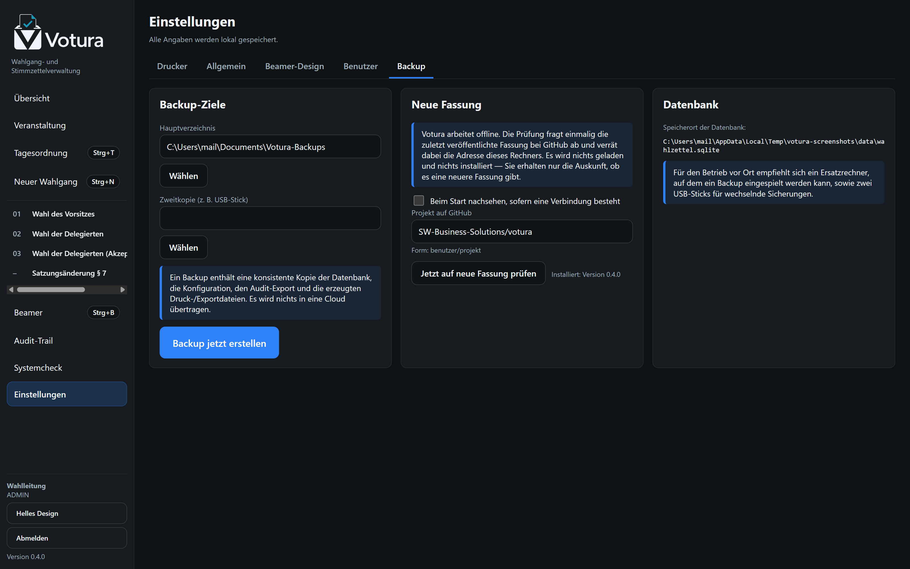

<p align="center">
  
  
</p>


Offline-Desktopanwendung zur Verwaltung von Wahlgängen und zum Druck papierbasierter
Stimmzettel auf Thermodruckern — mit Beamer-/Publikumsansicht für Mitgliederversammlungen.

> **Das System ist kein elektronisches Wahlsystem.** Die Stimme existiert ausschließlich auf dem
> anonymen Papier-Stimmzettel. Die Software kennt Wahlgang, Kandidaten, Stückzahlen und Ergebnis —
> sie kennt **nicht**, wer welchen Stimmzettel ausgefüllt hat.


## Überblick

| Bereich | Umsetzung |
|---|---|
| Plattform | Electron 43 (Chromium + Node 24), React 19, TypeScript |
| Datenhaltung | SQLite über `node:sqlite` (WAL), lokal im Benutzerprofil |
| Druck | ESC/POS; Epson ePOS-Print (LAN/XML), RAW-Netzwerk (9100), Windows-Spooler (USB), Dateiausgabe |
| Beamer | Zweites, rein lesendes Fenster + optionale Netzwerkansicht im Browser |
| Betrieb | Vollständig offline: keine Cloud, keine Telemetrie, keine externen Schriften |
| Installation | Windows-Installer (NSIS) und portable Fassung |

## Herunterladen

Fertige Windows-Fassungen liegen unter [Releases](../../releases):

- `Votura-<version>-x64-Setup.exe` — Installer
- `Votura-<version>-x64-portable.exe` — ohne Installation lauffähig

Die Dateien sind nicht signiert; Windows SmartScreen meldet sich daher beim ersten Start
(„Weitere Informationen" → „Trotzdem ausführen").

## Schnellstart (Entwicklung)

```bash
npm install
npm run dev          # Anwendung mit Hot Reload starten
npm test             # 134 Unit- und Integrationstests
npm run typecheck    # Typprüfung für Main-, Preload- und Renderer-Code
npm run build        # Produktionsbundle nach out/
npm run dist:win     # Windows-Installer und portable EXE nach release/
```

Die Installationsdateien liegen anschließend unter `release/`:

- `Votura-<version>-x64-Setup.exe` — Installer mit Desktop- und Startmenü-Verknüpfung
- `Votura-<version>-x64-portable.exe` — ohne Installation lauffähig (z. B. vom USB-Stick)

## Ablauf einer Versammlung

```
Veranstaltung anlegen → Wahlgang (Wizard) → Kandidaten → Liste schließen →
Druckvorschau → Prüfliste → Freigabe → Massendruck → Stimmabgabe auf Papier →
manuelle Auszählung → Ergebnis erfassen → Feststellung bestätigen → Wahlgang abschließen
```

Die Beameransicht folgt diesen Schritten automatisch; Ergebnisse erscheinen dort erst nach
ausdrücklicher Bestätigung durch die Wahlleitung.

<table>
<tr>
<td width="50%"><br><sub><b>Kandidaten</b> — erfassen, sortieren, nummerieren; die Liste wird vor der Freigabe geschlossen.</sub></td>
<td width="50%"><br><sub><b>Stimmzettel</b> — zeichengetreue Vorschau des Bons, Prüfliste und Freigabe mit SHA-256-Hash.</sub></td>
</tr>
<tr>
<td width="50%"><br><sub><b>Druck</b> — Stückzahl, Drucker und Testdruck; jeder Auftrag wird protokolliert.</sub></td>
<td width="50%"><br><sub><b>Ergebnis</b> — Auszählung erfassen, Plausibilität prüfen, Feststellung durch die Wahlleitung.</sub></td>
</tr>
</table>

## Wahlverfahren

Wahlzweck (`purpose`) und Wahlverfahren (`procedure`) sind strikt getrennt: Aus „Delegiertenwahl"
folgt kein Verfahren — das beschließt die Versammlung. Dieselbe Delegiertenwahl kann als
Gruppenwahl, als Akzeptanzwahl oder in zwei Stufen durchgeführt werden; der Stimmzettel sieht
jeweils anders aus.

### Personenwahlen

| Verfahren | Stimmzettel | Wofür |
|---|---|---|
| **Einzelwahl – ein Kandidat** | ein Name, global `JA` / `NEIN` / `ENTHALTUNG` | Eine Position, ein Bewerber |
| **Einzelwahl – mehrere Kandidaten** | alle Namen, eine Stimme, dazu `NEIN` / `ENTHALTUNG` | Eine Position, mehrere Bewerber |
| **Stichwahl** | die verbliebenen Bewerber, eine Stimme | Zweiter Durchgang ohne erreichte Mehrheit |
| **Verbundene Einzelwahl** | je Position ein eigener Abschnitt | Mehrere Positionen auf einem Zettel, getrennt entschieden |
| **Gruppenwahl – vorgedruckt** | alle Namen mit Ankreuzfeld, höchstens *n* Stimmen | Mehrere gleichartige Sitze, Bewerberfeld steht fest |
| **Gruppenwahl – Blanko** | nummerierte Schreiblinien | Mehrere Sitze, Namen werden handschriftlich eingetragen |
| **Akzeptanzwahl – Einzelposition** | `JA` / `NEIN` / `ENTHALTUNG` **je Bewerber** | Jeder Bewerber wird einzeln beurteilt |
| **Akzeptanzwahl – mehrere Positionen** | `JA` / `NEIN` / `ENTHALTUNG` **je Bewerber** | Gewählt ist, wer mehr Ja- als Nein-Stimmen hat |
| **Zwei-Stufen-Wahl – Stufe 1** | alle Namen, ohne feste Höchstzahl | Vorauswahl des Bewerberfelds |
| **Zwei-Stufen-Wahl – Stufe 2, Einzelplatz** | die Vorausgewählten, eine Stimme | Listenplatz für Listenplatz besetzen |
| **Zwei-Stufen-Wahl – Stufe 2, Wahlblock** | die Vorausgewählten, *n* Stimmen | Mehrere Listenplätze in einem Block |

### Sachabstimmungen

| Verfahren | Stimmzettel | Wofür |
|---|---|---|
| **Ja / Nein / Enthaltung** | Beschlusstext, drei Optionen | Anträge, Satzungsänderungen |
| **Eine von mehreren Optionen** | Optionen, eine Stimme | Auswahl zwischen Vorschlägen |
| **Mehrere Optionen** | Optionen, mehrere Stimmen | Zustimmung zu mehreren Punkten |
| **Variantenwahl / Alternativanträge** | Varianten, eine Stimme | Konkurrierende Anträge |
| **Offene Abstimmung** | **kein Stimmzettel** | Handzeichen oder Stimmkarte; nur Stimmen werden gezählt |

### Beispiel: dieselbe Delegiertenwahl in zwei Verfahren

Der Demo-Bestand enthält beide Fassungen — links die Gruppenwahl (ankreuzen, höchstens acht
Stimmen), rechts die Akzeptanzwahl (jeder Bewerber einzeln mit `JA` / `NEIN` / `ENTHALTUNG`).

<table>
<tr>
<td width="50%"><br><sub><b>Gruppenwahl</b> — ein Ankreuzfeld je Name, Nein und Enthaltung gelten für den ganzen Zettel und stehen am Ende.</sub></td>
<td width="50%"><br><sub><b>Akzeptanzwahl</b> — unter jedem Namen ein eigenes Votum; die Kopfzeile weist das Verfahren aus.</sub></td>
</tr>
<tr>
<td width="50%"><br><sub><b>Ergebnis</b> — Stimmen je Bewerber, Rangfolge und Sitzgrenze.</sub></td>
<td width="50%"><br><sub><b>Ergebnis</b> — Ja/Nein/Enthaltung je Bewerber. Wer nicht mehr Ja- als Nein-Stimmen hat, wird gekennzeichnet; hier bleibt der fünfte Platz unbesetzt.</sub></td>
</tr>
</table>

Zu jedem Verfahren gehören eigene Vorgaben für Höchststimmenzahl, Mindestzahl an Bewerbern, die
Frage, ob mehrere Sitze zu besetzen sind, und der Vorschlag für die Feststellung. Was auf dem
Zettel steht — `JA`, `NEIN`, `ENTHALTUNG`, Kandidatennummern, Kumulieren, Abstände —, bleibt je
Wahlgang einstellbar, weil es sich nach der geltenden Wahlordnung richtet und nicht nach der
Software.

## Sicherheitszusagen (technisch durchgesetzt)

- **Kein Personenbezug:** Es existiert keine Datenstruktur, die eine Person mit einem Stimmzettel
  verbindet. Ausgabe, Ersatz und Rücknahme werden ausschließlich als Mengen dokumentiert.
- **Keine Einzelkennung:** Alle Stimmzettel eines Wahlgangs sind identisch und tragen dieselbe
  Wahlgangkennung — keine Seriennummern, keine Codes je Zettel.
- **Freigabe vor Druck:** Ohne freigegebene Version verweigert der Druckdienst den Auftrag.
- **Versionierung:** Jede druckrelevante Änderung nach der Freigabe erzeugt eine neue Version;
  die alte bleibt mit SHA-256-Hash archiviert.
- **Keine automatische Wiederholung:** Ein abgebrochener oder unklarer Druckauftrag wird nie
  automatisch neu gedruckt; die tatsächliche Menge wird physisch geprüft und dokumentiert.
- **Idempotenz:** Ein identischer Druckauftrag (Idempotency-Key) wird nicht doppelt ausgeführt.
- **Ehrliche Zählung:** Gezählt wird, was an den Drucker übermittelt wurde. „Physisch gedruckt"
  behauptet die Anwendung erst nach menschlicher Bestätigung.
- **Audit-Trail:** Append-only mit Hash-Kette; nachträgliche Änderungen werden erkannt.
- **Unveränderbarkeit:** Abgeschlossene Wahlgänge sind im normalen Betrieb gesperrt.
- **Beamer read-only:** Die Publikumsansicht besitzt keine Schreib-API und erhält nur reduzierte
  Anzeige-DTOs — keine IDs, Hashes oder internen Notizen.
- **Kein Selbstaktualisieren:** Die Anwendung lädt und installiert nichts von sich aus; die
  laufende Fassung bleibt die geprüfte Fassung.

## Nachvollziehbarkeit

<table>
<tr>
<td width="50%"><br><sub><b>Audit-Trail</b> — jede Handlung mit Zeit, Person und Begründung, als Hash-Kette gesichert.</sub></td>
<td width="50%"><br><sub><b>Systemcheck</b> — Drucker, Papier, Speicherplatz und Datenbank vor der Versammlung prüfen.</sub></td>
</tr>
</table>

## Drucker

Zielklasse: 80 mm, 203 dpi, Auto-Cutter, ESC/POS. Vier Anbindungen stehen zur Wahl:

1. **Epson ePOS-Print** (empfohlen bei Epson-Netzwerkgeräten): Epsons eigene XML-Schnittstelle über
   HTTP im LAN. Liefert als einzige Anbindung echten Gerätestatus (Papier, Abdeckung, Cutter).
2. **ESC/POS RAW** über Port 9100 für beliebige Netzwerk-Thermodrucker.
3. **Windows-Spooler (RAW)** für USB-Drucker mit installiertem Epson-Treiber.
4. **Dateiausgabe** als Ersatzweg ohne Drucker (Textfassung + ESC/POS-Rohdaten).

Alle Layoutparameter (Breite, Zeichen je Zeile, Zeichentabelle, Cutter, Vorschub) sind je Drucker
konfigurierbar.

## Beameransicht


Die Publikumsansicht kennt eigene Bilder für Begrüßung, Tagesordnung, Kandidatenvorstellung,
laufende Wahl, Auszählung, Ergebnis, Pause mit Countdown und freie Mitteilungen. Farben, Logo und
Schriftgröße sind einstellbar; lange Listen blättern seitenweise um, und die Anzeige misst nach
jedem Wechsel nach, ob alles ins Bild passt.

<table>
<tr>
<td width="50%"><br><sub><b>Steuerung</b> — Bild wählen, Vorschau, Netzwerkansicht und Sperre während laufender Wahl.</sub></td>
<td width="50%"><br><sub><b>Tagesordnung</b> — vorab anlegen, frei sortieren, Anträge dazwischenschieben.</sub></td>
</tr>
</table>

## Netzwerkbetrieb

Zwei getrennt schaltbare Funktionen, beide standardmäßig **deaktiviert** und nur für ein
abgeschottetes Veranstaltungsnetz vorgesehen:

- **Beameransicht im Browser** (`/`) — ausschließlich lesende Endpunkte, Server-Sent-Events,
  optionales Zugriffstoken.
- **Bedienung von einem zweiten Gerät** (`/operator`) — Anmeldung mit einem lokalen Konto, gleiche
  Rollen und Rechte, gleiche Audit-Zuordnung. Jeder Aufruf läuft im Sitzungskontext des
  angemeldeten Benutzers; Systemdialoge des Hauptrechners sind gesperrt. Details und Grenzen:
  `docs/adr/0005-fernzugriff-im-veranstaltungsnetz.md`.

## Hinweis auf neue Fassungen

Votura aktualisiert sich **nicht** selbst. Es gibt lediglich eine Auskunft darüber, ob eine neuere
Fassung veröffentlicht wurde:



- **Standardmäßig abgeschaltet.** Ohne ausdrückliche Einstellung nimmt die Anwendung keinerlei
  Verbindung nach außen auf.
- Die Prüfung erfolgt auf Knopfdruck oder — wenn eingeschaltet — einmal beim Start. Abgefragt wird
  ausschließlich die öffentliche Release-Schnittstelle von GitHub; dabei wird die Adresse des
  Rechners übermittelt, worauf die Einstellungsseite hinweist.
- **Einspielen auf Knopfdruck, nie von selbst.** Liegt eine neuere Fassung vor, lässt sie sich
  direkt aus der Anwendung heraus herunterladen und installieren — nach ausdrücklicher Bestätigung,
  mit Prüfung gegen die veröffentlichte SHA-512-Prüfsumme und mit Eintrag im Audit-Trail.
- **Gesperrt während einer Versammlung.** Solange ein Wahlgang nicht abgeschlossen ist, verweigert
  die Anwendung den Wechsel und nennt den Grund.

Der Grund für diese Zurückhaltung ist nicht technischer Natur: Geprüft, freigegeben und im
Audit-Trail dokumentiert ist immer die Fassung, die gerade läuft. Eine Wahlanwendung, die sich
während einer Versammlung selbst austauscht, wäre nicht mehr nachvollziehbar. Deshalb gibt es einen
Knopf — aber keinen Automatismus.

Bei der **portablen Fassung** wird nichts überschrieben: Die neue Programmdatei wird neben die
laufende gelegt und der Ordner geöffnet. Den Wechsel vollziehen Sie selbst; die Daten im Ordner
`Votura-Daten` bleiben unberührt.

## Datenablage

**Installierte Fassung** — im Benutzerprofil:

```
%APPDATA%\Votura\
  data\wahlzettel.sqlite   Datenbank (WAL)
  exports\                 PDF-, CSV-, JSON-Exporte und Archivpakete
  logs\application.log     technische Logs (getrennt vom Audit-Trail)
  logs\printer.log         Druckerprotokoll
```

Backups (konsistente Datenbankkopie, Konfiguration, Audit-Export, Exporte) landen standardmäßig
unter `Dokumente\Votura-Backups`; ein zweites Ziel (z. B. USB-Stick) ist konfigurierbar.

**Portable Fassung** — alles neben der Programmdatei. Programm und Daten bleiben zusammen, etwa auf
einem USB-Stick, und der benutzte Rechner behält nichts zurück:

```
<Ordner der EXE>\
  Votura-0.4.0-x64-portable.exe
  Votura-Daten\
    data\wahlzettel.sqlite
    exports\   logs\   backups\   tmp\
```

Ist der Ort nicht beschreibbar — schreibgeschützter Stick, fehlende Rechte —, weicht die Anwendung
auf das Benutzerprofil aus, statt den Start zu verweigern.

## Rechtlicher Hinweis

Die Anwendung unterstützt die organisatorische Durchführung einer Wahl. Sie ersetzt weder
Wahlleitung noch Satzung oder Wahlordnung und trifft keine rechtliche Entscheidung über die
Gültigkeit einer Wahl. Vor jedem Einsatz ist zu prüfen, welche Wahlordnung für die konkrete
Gliederung gilt; die zugrunde gelegte Fassung wird je Veranstaltung dokumentiert.

## Lizenz

Noch keine Lizenz vergeben — es gelten die gesetzlichen Vorgaben (alle Rechte vorbehalten).
Wer den Code nutzen möchte, wendet sich bitte an den Autor.

## Dokumentation

- `docs/architektur.md` — Aufbau, Schichten, Datenmodell
- `docs/betrieb.md` — Betriebshandbuch für die Versammlung
- `docs/adr/` — Architekturentscheidungen mit Begründung
