# Betriebshandbuch

## Vor der Versammlung

1. **Installieren:** `Votura-<version>-x64-Setup.exe` ausführen (keine Administratorrechte
   nötig, Installation je Benutzer). Alternativ die portable Fassung vom USB-Stick starten.
2. **Konten anlegen:** Beim ersten Start ein Administratorkonto anlegen, danach unter
   *Einstellungen → Benutzer* Konten für Wahlleitung, Wahlkommission und Protokoll ergänzen.
3. **PIN setzen:** Unter *Einstellungen → Allgemein* eine Wahlleiter-PIN hinterlegen, wenn
   Massendruck und Ergebnisbestätigung PIN-geschützt sein sollen (Standard: ja).
4. **Drucker einrichten:** *Einstellungen → Drucker*. Für Epson-Netzwerkgeräte „Epson ePOS-Print"
   mit IP wählen, für USB-Geräte „ESC/POS über Windows-Druckertreiber" mit dem exakten
   Windows-Druckernamen. Anschließend *Verbindung prüfen*.
5. **Backup-Ziele festlegen:** *Einstellungen → Backup*, möglichst ein zweites Ziel auf USB-Stick.
6. **Systemcheck ausführen:** Menüpunkt *Systemcheck*. Alle Punkte prüfen, insbesondere Drucker,
   Testdruck, Zeitzone und Backup-Verzeichnis.
7. **Testdruck:** Im Wahlgang unter *Drucken → Testdruck*. Der Testdruck ist oben und unten
   unübersehbar als ungültig gekennzeichnet und muss sofort vernichtet werden.
8. **Offline prüfen:** Netzwerkkabel ziehen bzw. WLAN abschalten und einen Testdurchlauf machen —
   die Anwendung benötigt keinerlei Internetverbindung. (Für Netzwerkdrucker und die
   Netzwerk-Beameransicht ist ein lokales Netz nötig, kein Internet.)

## Hardware vor Ort

- 1 Haupt-PC, 1 Ersatz-PC (mit installierter Anwendung)
- 1 Hauptdrucker, 1 Ersatzdrucker, ausreichend Thermorollen
- 2 USB-Sticks für wechselnde Backups
- USV oder Notebook-Akkubetrieb
- Beamer/Bildschirm am zweiten Grafikausgang

## Tagesordnung vorbereiten

Unter *Tagesordnung* (Strg+T) legen Sie die Punkte vorab an — auch reine Tagesordnungspunkte ohne
Wahlgang (z. B. „Bericht des Vorstands"). Wahlgänge erscheinen automatisch in der Liste.

- **Verschieben:** per Ziehen oder mit den Pfeiltasten in der Zeile.
- **Einschieben:** beim Hinzufügen die Position „vor …" wählen — so kommt ein Änderungsantrag genau
  zwischen zwei Anträge.
- **Abhaken:** erledigte Punkte markieren; der erste offene Punkt gilt als aktueller.
- **Anzeigen:** „Auf Beamer zeigen" projiziert die vollständige Tagesordnung mit hervorgehobenem
  aktuellem Punkt.

Ein vorbereiteter Wahlgang bekommt **erst beim Start** seine Nummer und Wahlgangkennung. Bis dahin
lässt sich die Reihenfolge gefahrlos ändern, ohne dass Kennungen wandern.

## Ablauf je Wahlgang

1. **Anlegen** (*Neuer Wahlgang*, Strg+N): Zweck wählen, **Verfahren gemäß Beschluss der
   Versammlung** wählen, Positionen und Stimmenzahl festlegen, Kandidaten einfügen (Copy/Paste
   möglich), Parameter prüfen.
2. **Kandidaten** ordnen (manuell, alphabetisch, per Beschluss; Zufall nur auf ausdrückliche
   Anordnung) und ggf. Nummern vergeben.
3. **Liste schließen.** Danach sind Änderungen nur durch Entsperren mit Begründung möglich.
4. **Wahlzettel** prüfen: Druckvorschau lesen, Prüfliste abhaken, **freigeben**.
5. **Drucken:** Stückzahl = Stimmberechtigte + Reserve. Massendruck bestätigen (PIN).
   Den Fortschritt beobachten; bei Abbruch die tatsächliche Menge physisch zählen.
6. **Ausgabe dokumentieren:** Reiter *Stimmzettelbilanz* — ausgegeben, Ersatz, zurückgenommen,
   unbenutzt. Nur Mengen, niemals Namen.
7. **Wahl eröffnen** (Reiter *Verlauf*): Der Beamer zeigt „WAHL LÄUFT".
8. **Stimmabgabe beenden** → Auszählung. Der Beamer zeigt „AUSZÄHLUNG LÄUFT".
9. **Ergebnis erfassen** (Reiter *Ergebnis*), Plausibilitätshinweise prüfen.
10. **Feststellung treffen:** Der rechnerische Vorschlag ist nur ein Vorschlag. Die Wahlleitung
    wählt die öffentliche Feststellung und die als gewählt festgestellten Personen aus.
11. **Ergebnis bestätigen** — erst dadurch wird es auf dem Beamer öffentlich.
12. **Wahlgang abschließen.** Danach im normalen Betrieb unveränderbar.
13. Bei Bedarf **Folgewahlgang** erzeugen (Stichwahl, Wiederholung, Nachwahl, zweiter Wahlgang) —
    mit eigener Kennung und neuer Zettelversion.

## Beamer bedienen

- *Beamer* (Strg+B) → Bildschirm auswählen → *Beamerfenster öffnen*.
- **Erscheinungsbild:** unter *Einstellungen → Beamer-Design* Farben wählen und ein Logo hinterlegen
  (wird in die Konfiguration eingebettet, kein Nachladen aus dem Netz).
- **Pause mit Countdown:** Dauer in Minuten eintragen und *Pause anzeigen*. Für die Stimmabgabe gibt
  es bewusst keinen Countdown.
- **Freie Mitteilung:** optional mit oder ohne Wahlgangbezug in der Fußzeile.
- **Sachanträge:** Beschlusstext und Abstimmungsmöglichkeiten werden statt einer Kandidatenliste
  angezeigt.
- **Ergebnis:** standardmäßig vollständig — auch die nicht gewählten Bewerber mit ihrer Stimmenzahl.
- Die Vorschau links zeigt jederzeit exakt das, was öffentlich zu sehen ist.
- Statuswechsel erfolgen automatisch aus dem Wahlgang; manuelle Übersteuerung ist jederzeit möglich
  (Pause, freie Mitteilung, Tagesordnung).
- *Beamer sperren* verhindert während laufender Wahl ein versehentliches Umschalten.
- Bei nur einem Bildschirm öffnet das Fenster bewusst im Fenstermodus.
- **Netzwerkansicht** (optional): aktivieren, Port und Token vergeben, angezeigte Adresse am
  Zweitgerät im Browser öffnen. Rein lesend; nur in einem abgeschotteten Veranstaltungsnetz nutzen.

## Zweites Gerät im Veranstaltungsnetz

Unter *Beamer → Beamer im Netzwerk* lassen sich zwei Dinge getrennt freischalten:

1. **Beameransicht** — rein lesend, Adresse `http://<IP>:8477/`
2. **Bedienung** — Adresse `http://<IP>:8477/operator`, Anmeldung mit einem lokalen Konto

Für die Bedienung gelten dieselben Rollen und Rechte wie am Hauptrechner; jede Aktion steht mit dem
jeweiligen Benutzer im Audit-Trail. Nach fünf Fehlversuchen ist das Gerät eine Minute gesperrt.

Zu beachten:
- Nur in einem **abgeschotteten** Veranstaltungsnetz verwenden — die Verbindung ist unverschlüsselt.
- Ordnerauswahl, Logo-Auswahl und „Speichern unter" funktionieren nur am Hauptrechner.
- Der Druckfortschritt wird live nur am Hauptrechner angezeigt; am Zweitgerät erscheint das Ergebnis,
  sobald der Auftrag abgeschlossen ist.
- Arbeiten zwei Personen am selben Wahlgang, meldet die Anwendung beim Speichern einen veralteten
  Stand statt zu überschreiben.

## Zwischenfälle

| Situation | Vorgehen |
|---|---|
| Drucker verliert Verbindung | Auftrag stoppt, Status „unklar". Gedruckte Zettel zählen, Menge im Dialog bestätigen, dann gezielt nachdrucken. |
| Papier leer | Rolle wechseln, Auftrag physisch prüfen, fehlende Menge als Nachdruck mit Grund erzeugen. |
| Anwendung stürzt ab | Neu starten; die Daten sind gespeichert. Der Wiederanlauf-Dialog fragt unklare Druckaufträge ab. Es wird nie automatisch nachgedruckt. |
| Kandidat falsch geschrieben (vor Freigabe) | Einfach korrigieren. |
| Kandidat falsch geschrieben (nach Freigabe) | Entsperren mit Begründung → neue Version → erneut freigeben → **alte und neue Stapel nicht mischen**. |
| Kandidat zieht zurück | Als zurückgezogen markieren (kein Löschen). Nach Freigabe: Entscheidung der Wahlleitung, dann neue Version. |
| Beschädigter Stimmzettel | Ersatz ausgeben, im Reiter *Stimmzettelbilanz* als Menge erfassen (Ersatz +1, zurückgenommen +1). |
| Stimmengleichheit | Wird markiert, nicht automatisch aufgelöst. Feststellung bzw. Losentscheid dokumentieren; optional Protokollbeleg drucken (kein Stimmzettel). |

## Nach der Versammlung

1. Ergebnisse und Protokolle exportieren (*Ergebnis → Wahlprotokoll / Vollständiger Export*).
2. Alle Wahlgänge abschließen oder abbrechen, dann *Veranstaltung → Abschließen*.
3. *Archivieren* erzeugt das vollständige Archivpaket inkl. ZIP. Über *Archivdateien* lassen sich die
   einzelnen Dateien ansehen, im Explorer öffnen und per *Speichern unter …* auf einen USB-Stick
   kopieren.
4. **Backup erstellen** und auf beide USB-Sticks legen.
5. Papier-Stimmzettel gemäß Wahlordnung sammeln, verpacken und versiegeln. Ausgefüllte
   Stimmzettel werden **nicht** digitalisiert.

## Tastatur

| Kürzel | Funktion |
|---|---|
| Strg+N | Neuer Wahlgang |
| Strg+T | Tagesordnung |
| Strg+B | Beamer-Steuerung |
| Esc | Dialog schließen |

Kein Tastenkürzel löst einen Massendruck aus.

## Bildschirmansichten

Die folgenden Aufnahmen stammen aus einem Demo-Bestand und lassen sich mit
`node tools/screenshots.mjs` jederzeit neu erzeugen.

| Ansicht | Zweck |
|---|---|
| 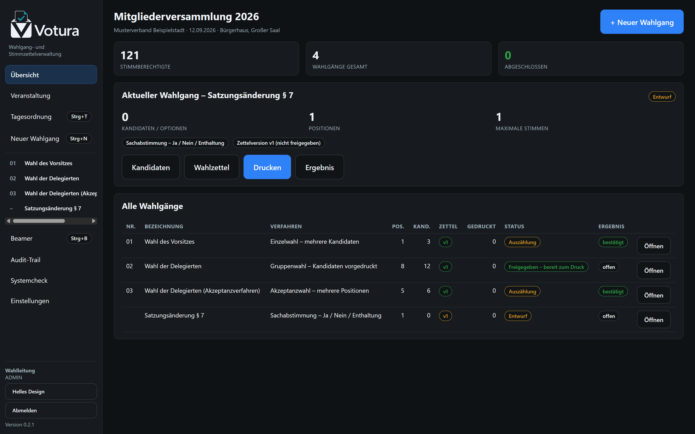 | Stand der Versammlung: Wahlgänge, Zettelversionen, Druckmengen, Ergebnisse |
| 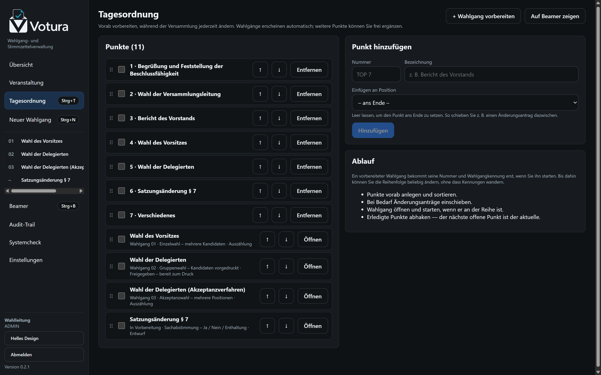 | Punkte vorab anlegen, sortieren, Anträge einschieben |
| 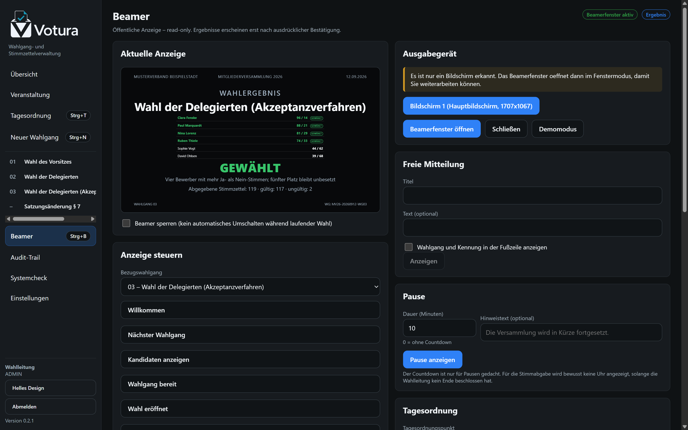 | Auswahl des Bildes, Vorschau, Netzwerkansicht, Sperre |
| 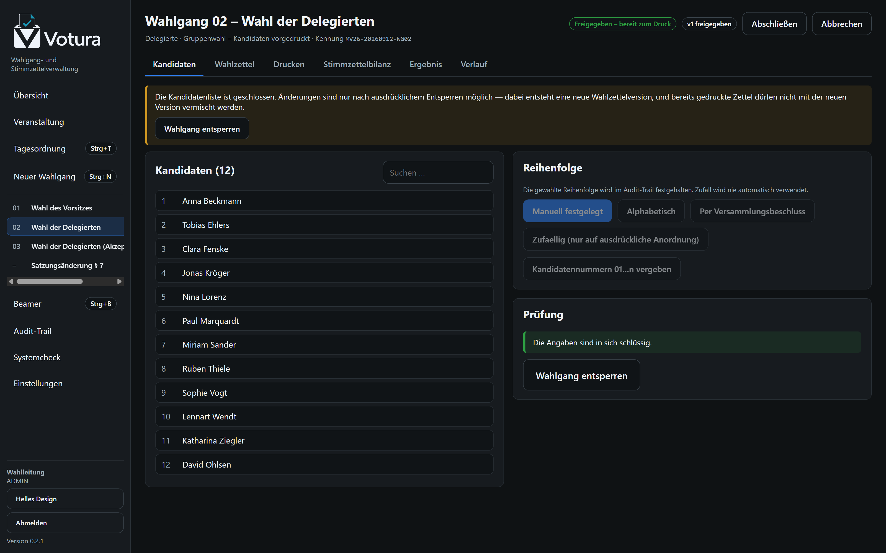 | Bewerber erfassen, sortieren, zurückziehen |
| 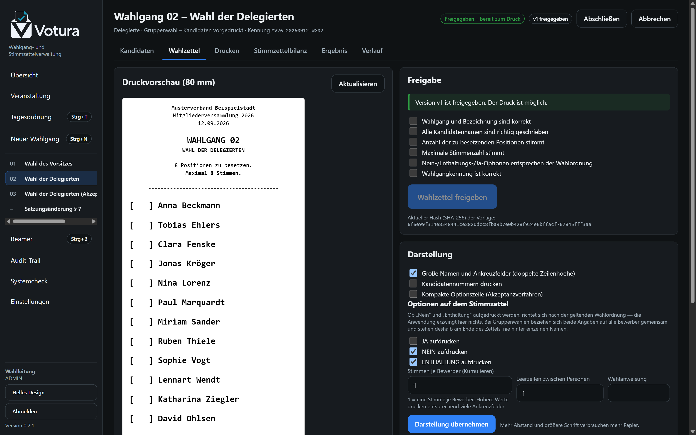 | Druckvorschau, Prüfliste, Freigabe |
| 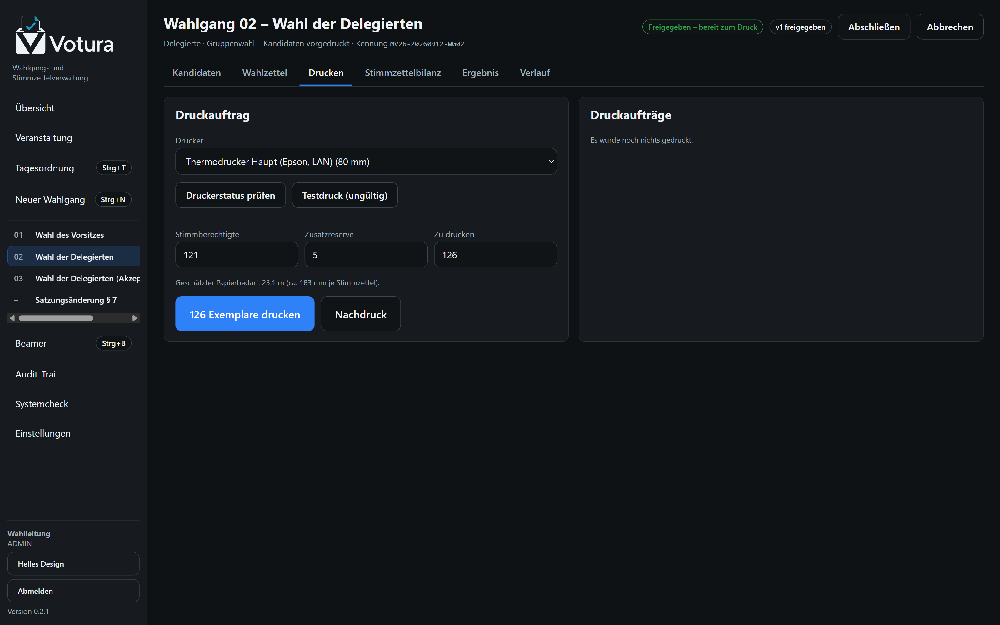 | Stückzahl, Drucker, Testdruck, Protokoll |
| 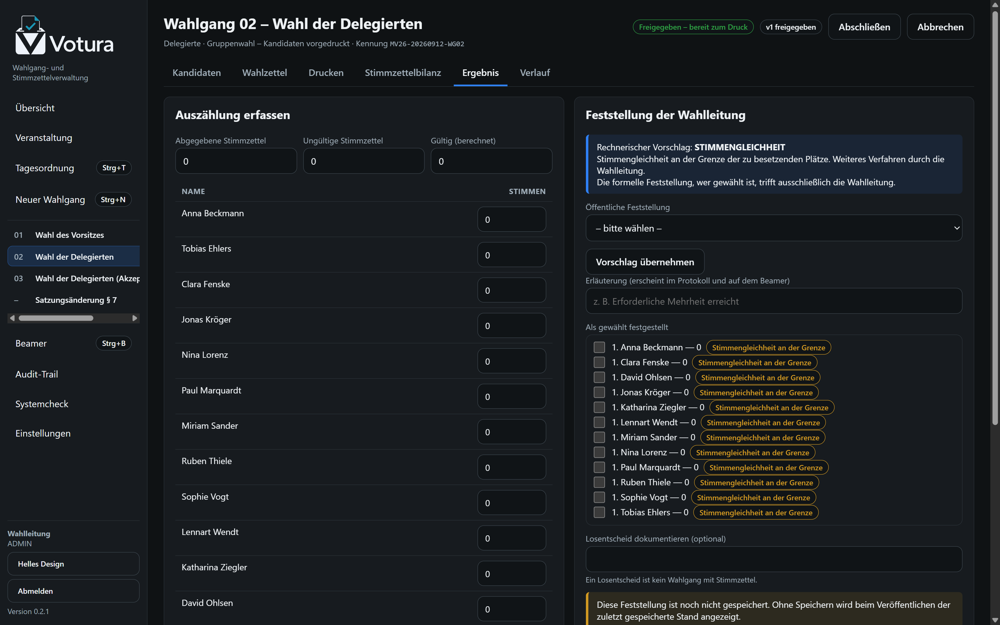 | Auszählung, Plausibilitätsprüfung, Feststellung |
| 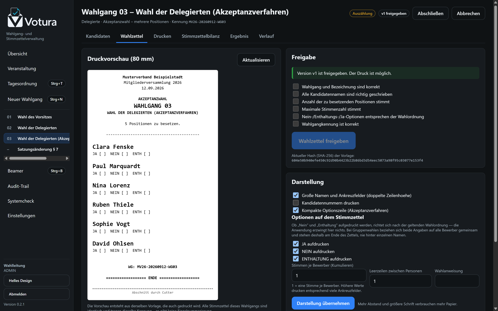 | Akzeptanzverfahren: Ja/Nein/Enthaltung je Bewerber |
| 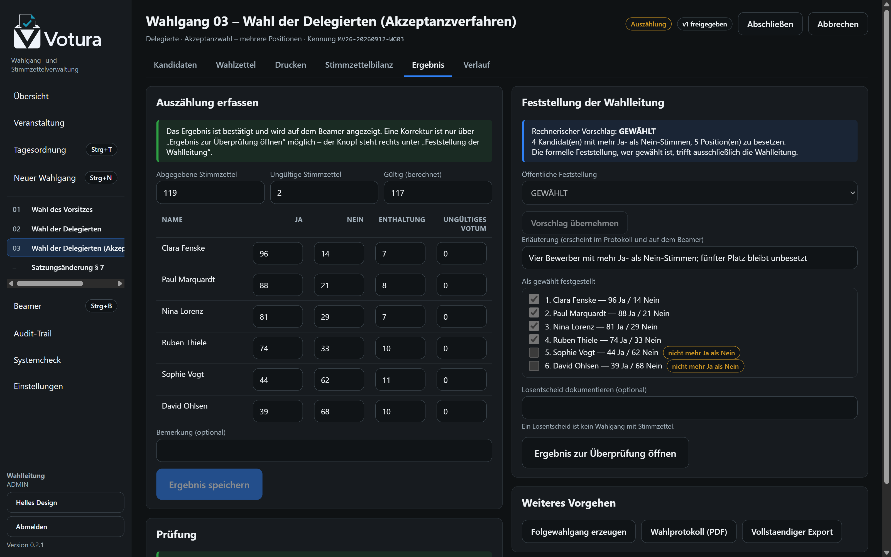 | Gewählt ist, wer mehr Ja- als Nein-Stimmen hat |
| 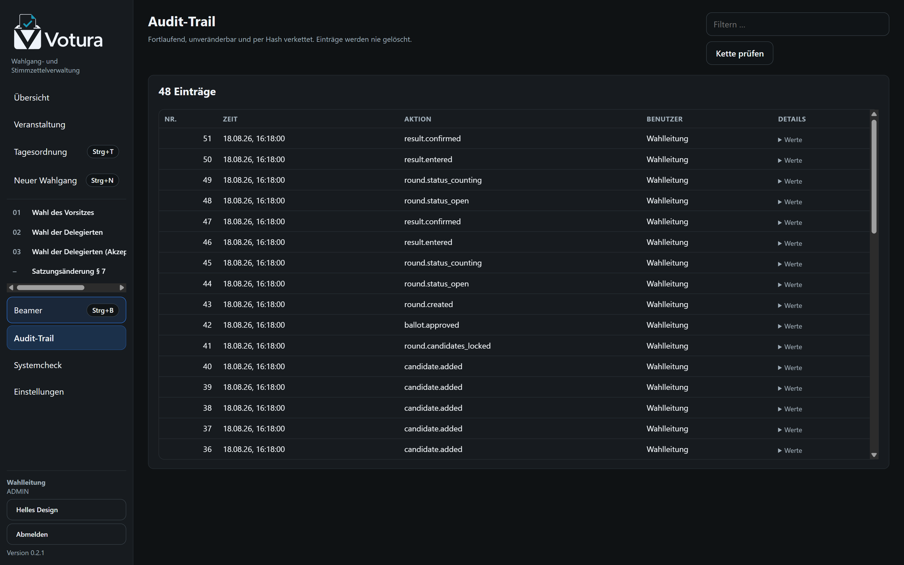 | Lückenlose Nachvollziehbarkeit aller Handlungen |
| 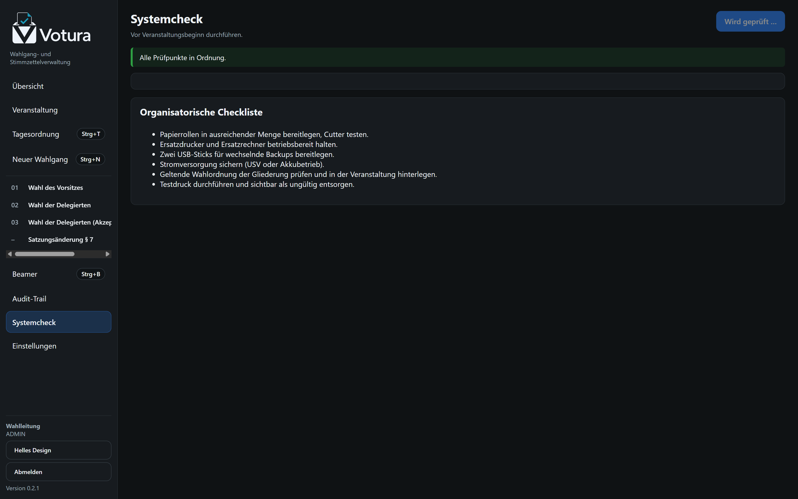 | Prüfung vor der Versammlung |
| 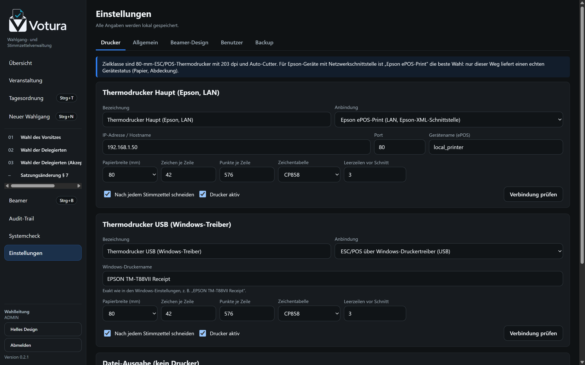 | Drucker, Sicherheit, Konten, Beamer-Erscheinungsbild |
| 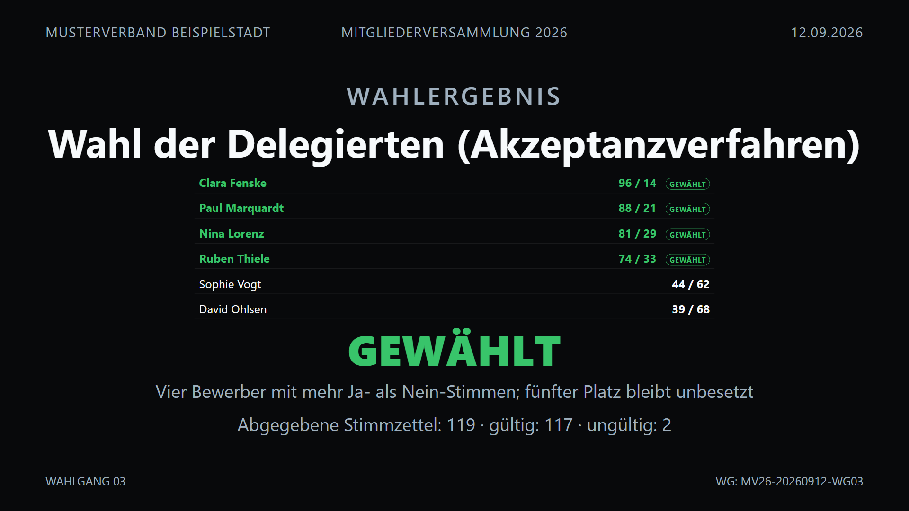 | Öffentliche Anzeige des Ergebnisses |
