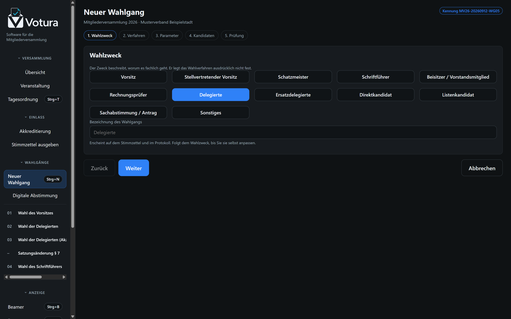
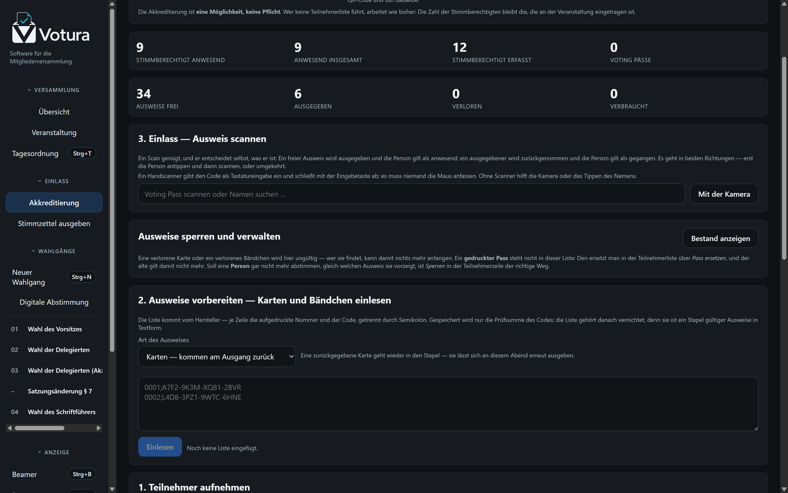
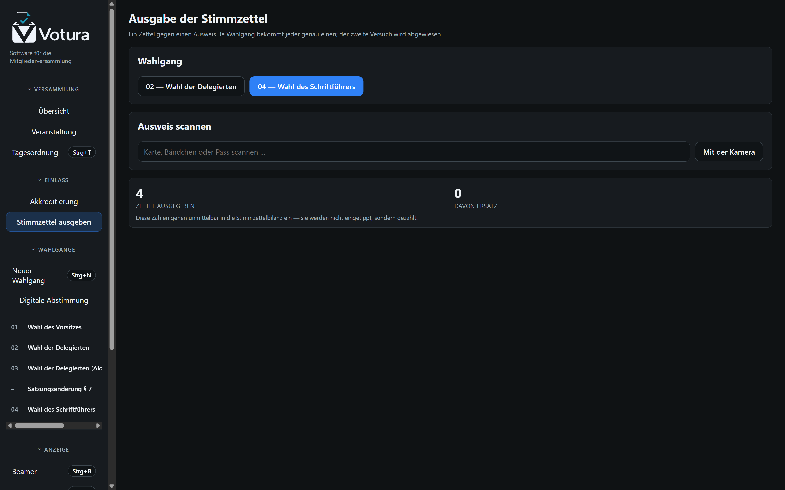
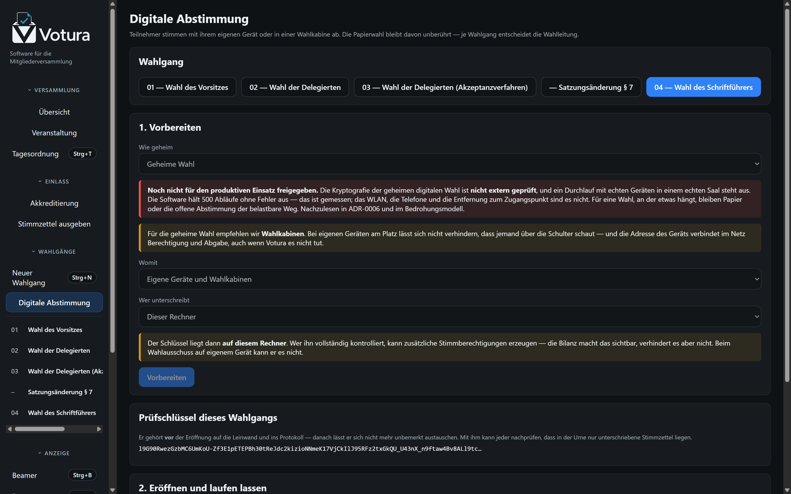
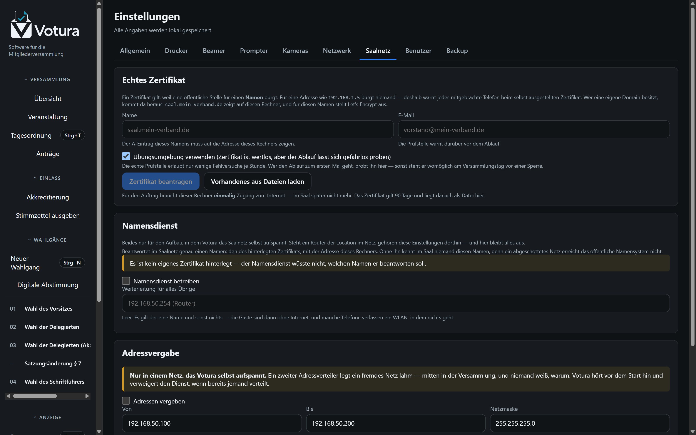
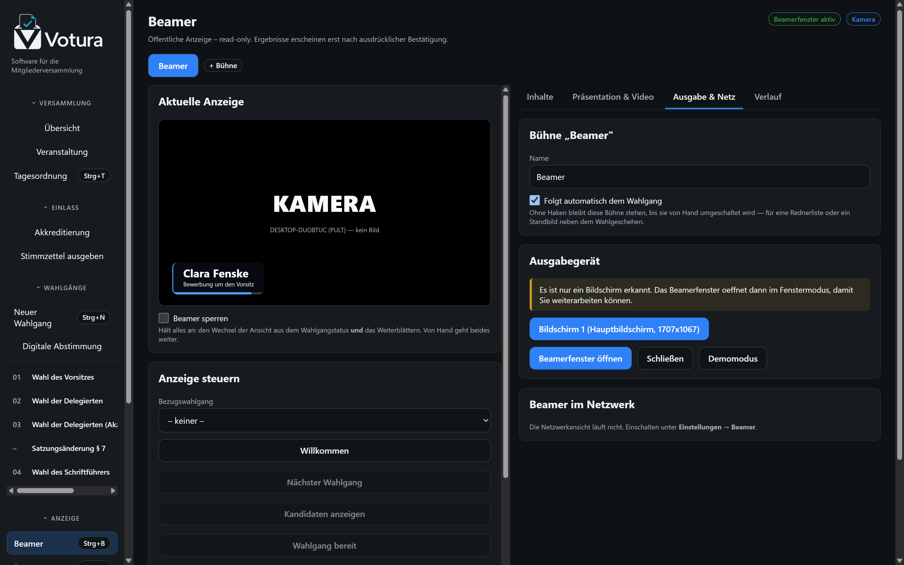
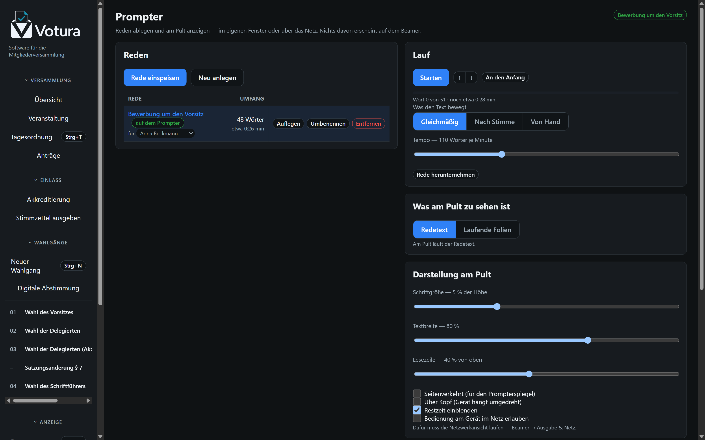
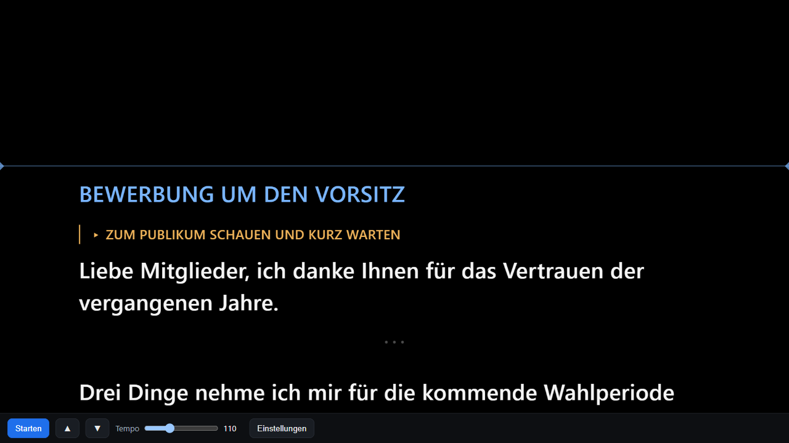

# Betriebshandbuch

Votura ist die **Software für die Mitgliederversammlung**: Wahlgänge und Stimmzettel, die Anzeige
im Saal und das Pult vorn. Dieses Handbuch geht den Abend der Reihe nach durch — vorbereiten,
durchführen, nachbereiten. Wer nur einen Wahlgang durchbringen muss, liest die ersten vier
Abschnitte; alles Weitere steht dort, wo es gebraucht wird.

## Vor der Versammlung

1. **Installieren:** `Votura-<version>-x64-Setup.exe` ausführen (keine Administratorrechte
   nötig, Installation je Benutzer). Alternativ die portable Fassung vom USB-Stick starten.
2. **Konten anlegen:** Beim ersten Start ein Administratorkonto anlegen, danach unter
   _Einstellungen → Benutzer_ Konten für Wahlleitung, Wahlkommission und Protokoll ergänzen.
3. **PIN setzen:** Unter _Einstellungen → Allgemein_ eine Wahlleiter-PIN hinterlegen, wenn
   Massendruck und Ergebnisbestätigung PIN-geschützt sein sollen (Standard: ja).
4. **Drucker einrichten:** _Einstellungen → Drucker_. Für Epson-Netzwerkgeräte „Epson ePOS-Print"
   mit IP wählen, für USB-Geräte „ESC/POS über Windows-Druckertreiber" mit dem exakten
   Windows-Druckernamen. Anschließend _Verbindung prüfen_.
5. **Backup-Ziele festlegen:** _Einstellungen → Backup_, möglichst ein zweites Ziel auf USB-Stick.
6. **Systemcheck ausführen:** Menüpunkt _Systemcheck_. Alle Punkte prüfen, insbesondere Drucker,
   Testdruck, Zeitzone und Backup-Verzeichnis.
7. **Testdruck:** Im Wahlgang unter _Drucken → Testdruck_. Der Testdruck ist oben und unten
   unübersehbar als ungültig gekennzeichnet und muss sofort vernichtet werden.
8. **Offline prüfen:** Netzwerkkabel ziehen bzw. WLAN abschalten und einen Testdurchlauf machen —
   die Anwendung benötigt keinerlei Internetverbindung. (Für Netzwerkdrucker und die
   Netzwerk-Beameransicht ist ein lokales Netz nötig, kein Internet.)

## Hardware vor Ort

- 1 Haupt-PC, 1 Ersatz-PC (mit installierter Anwendung)
- 1 Hauptdrucker, 1 Ersatzdrucker, ausreichend Thermorollen
- 2 USB-Sticks für wechselnde Backups
- USV oder Notebook-Akkubetrieb
- Beamer/Bildschirm am zweiten Grafikausgang

## Tagesordnung vorbereiten

Unter _Tagesordnung_ (Strg+T) legen Sie die Punkte vorab an — auch reine Tagesordnungspunkte ohne
Wahlgang (z. B. „Bericht des Vorstands"). Wahlgänge erscheinen automatisch in der Liste.

- **Verschieben:** per Ziehen oder mit den Pfeiltasten in der Zeile.
- **Einschieben:** beim Hinzufügen die Position „vor …" wählen — so kommt ein Änderungsantrag genau
  zwischen zwei Anträge.
- **Abhaken:** erledigte Punkte markieren; der erste offene Punkt gilt als aktueller.
- **Anzeigen:** „Auf Beamer zeigen" projiziert die vollständige Tagesordnung mit hervorgehobenem
  aktuellem Punkt.

Ein vorbereiteter Wahlgang bekommt **erst beim Start** seine Nummer und Wahlgangkennung. Bis dahin
lässt sich die Reihenfolge gefahrlos ändern, ohne dass Kennungen wandern.

## Ablauf je Wahlgang

1. **Anlegen** (_Neuer Wahlgang_, Strg+N): Zweck wählen, **Verfahren gemäß Beschluss der
   Versammlung** wählen, Positionen und Stimmenzahl festlegen, Kandidaten einfügen (Copy/Paste
   möglich), Parameter prüfen.
2. **Kandidaten** ordnen (manuell, alphabetisch, per Beschluss; Zufall nur auf ausdrückliche
   Anordnung) und ggf. Nummern vergeben.
3. **Liste schließen.** Danach sind Änderungen nur durch Entsperren mit Begründung möglich.
4. **Wahlzettel** prüfen: Druckvorschau lesen, Prüfliste abhaken, **freigeben**.
5. **Drucken:** Stückzahl = Stimmberechtigte + Reserve. Massendruck bestätigen (PIN).
   Den Fortschritt beobachten; bei Abbruch die tatsächliche Menge physisch zählen.
6. **Ausgabe dokumentieren:** Reiter _Stimmzettelbilanz_ — ausgegeben, Ersatz, zurückgenommen,
   unbenutzt. Nur Mengen, niemals Namen.
7. **Wahl eröffnen** (Reiter _Verlauf_): Der Beamer zeigt „WAHL LÄUFT".
8. **Stimmabgabe beenden** → Auszählung. Der Beamer zeigt „AUSZÄHLUNG LÄUFT".
9. **Ergebnis erfassen** (Reiter _Ergebnis_), Plausibilitätshinweise prüfen.
10. **Feststellung treffen:** Der rechnerische Vorschlag ist nur ein Vorschlag. Die Wahlleitung
    wählt die öffentliche Feststellung und die als gewählt festgestellten Personen aus.
11. **Ergebnis bestätigen** — erst dadurch wird es auf dem Beamer öffentlich.
12. **Wahlgang abschließen.** Danach im normalen Betrieb unveränderbar.
13. Bei Bedarf **Folgewahlgang** erzeugen (Stichwahl, Wiederholung, Nachwahl, zweiter Wahlgang) —
    mit eigener Kennung und neuer Zettelversion.

## Beamer bedienen

- _Beamer_ (Strg+B) → Bildschirm auswählen → _Beamerfenster öffnen_.
- Die Seite ist gegliedert: Die Vorschau steht links fest, rechts liegen **Inhalte**,
  **Präsentation & Video**, **Ausgabe & Netz** und **Verlauf** hinter Reitern.
- **Erscheinungsbild:** unter _Einstellungen → Beamer-Design_ Farben wählen und ein Logo hinterlegen
  (wird in die Konfiguration eingebettet, kein Nachladen aus dem Netz).
- **Pause mit Countdown:** entweder _Dauer_ in Minuten oder _Bis Uhrzeit_ („weiter um 12:30", nach
  der Uhr dieses Rechners). Die Uhrzeit ist bei einer angesagten Pause die bessere Wahl: Sie bleibt
  richtig, auch wenn zwischen Ansage und Anzeigen noch Minuten vergehen. Für die Stimmabgabe gibt
  es bewusst keinen Countdown.
- **Freie Mitteilung:** optional mit oder ohne Wahlgangbezug in der Fußzeile.
- **Sachanträge:** Beschlusstext und Abstimmungsmöglichkeiten werden statt einer Kandidatenliste
  angezeigt.
- **Ergebnis:** standardmäßig vollständig — auch die nicht gewählten Bewerber mit ihrer Stimmenzahl.
- Die Vorschau links zeigt jederzeit exakt das, was öffentlich zu sehen ist.
- Statuswechsel erfolgen automatisch aus dem Wahlgang; manuelle Übersteuerung ist jederzeit möglich
  (Pause, freie Mitteilung, Tagesordnung).
- _Beamer sperren_ verhindert ein versehentliches Umschalten **und** hält das automatische
  Weiterblättern an. Bei langen Kandidaten- und Ergebnislisten ist das der Griff, wenn die Anzeige
  auf einer bestimmten Seite stehen bleiben soll — von Hand lässt sich weiter blättern.
- **Automatisch weiter:** unter der Vorschau einstellbar (aus, 8, 15 oder 30 Sekunden). Gilt für
  Kandidaten- und Ergebnisseiten.
- Bei nur einem Bildschirm öffnet das Fenster bewusst im Fenstermodus.
- **Netzwerkansicht** (optional): aktivieren, Port und Token vergeben, angezeigte Adresse am
  Zweitgerät im Browser öffnen. Rein lesend; nur in einem abgeschotteten Veranstaltungsnetz nutzen.

## Mehrere Bühnen

Bis zu vier Anzeigeflächen, jede mit eigenem Inhalt. Die Reiter stehen über der Steuerung; alles
darunter gilt für die dort gewählte Bühne.

- **Anlegen:** _+ Bühne_ rechts neben den Reitern. Die neue Bühne bekommt die nächste freie Nummer —
  sie steht später in der Netzadresse.
- **Benennen und Verhalten:** Reiter _Ausgabe & Netz_, Karte **Bühne „…"**. Dort auch
  _Folgt automatisch dem Wahlgang_: Ohne Haken bleibt die Bühne stehen, bis sie von Hand
  umgeschaltet wird — für eine Rednerliste oder ein Standbild neben dem Wahlgeschehen.
- **Fenster öffnen:** wie bei der Hauptbühne über _Ausgabe & Netz_ → Bildschirm wählen. Jede Bühne
  hat ihr eigenes Fenster; bei nur einem Bildschirm öffnen sie im Fenstermodus übereinander.
- **Im Netz:** `/b/2`, `/b/3` … Die vollständigen Adressen samt Token listet die Karte
  _Beamer im Netzwerk_ auf. Am besten neben dem jeweiligen Beamer notieren.
- **Alle zugleich:** der Reiter **Alle** ganz links. Jede Schaltung trifft dann jede Bühne — für
  „Pause", „Versammlung beendet" oder das Sperren aller Wände auf einmal. Die Vorschau zeigt dabei
  jede Bühne einzeln; steht auf den Wänden Verschiedenes, ist kein Knopf hervorgehoben und die
  Kopfzeile sagt es.
- **Abbauen:** _Bühne abbauen_ in derselben Karte. Das Fenster schließt sich mit; die Hauptbühne
  lässt sich nicht abbauen.
- **Die Vortragssteuerung** folgt der Bühne, auf der ein Foliensatz läuft. Laufen zwei, wählt die
  Liste im Fuß des Fensters.

## Teleprompter

_Prompter_ (Strg+P). Links die Reden, rechts der Lauf und die Darstellung.

- **Rede ablegen:** _Rede einspeisen_ holt eine Markdown-Datei (.md/.txt); _Neu anlegen_ öffnet ein
  leeres Blatt. Der Editor darunter speichert mit **Strg+S**; liegt die Rede gerade am Pult,
  bekommt sie den neuen Text, ohne an den Anfang zu springen.
- **Hinweise an sich selbst:** Eine Zeile in eckigen Klammern — `[Zum Publikum schauen]` — ist keine
  Zeile zum Vorlesen. Sie steht am Pult in Großbuchstaben und in anderer Farbe, wird **nicht
  mitgesprochen**, zählt **nicht zur Redezeit** und wird beim Mitlaufen nach Gehör übergangen. Im
  Lauf behält sie trotzdem einen Moment, sonst wäre sie vorbei, bevor jemand sie liest. Eine
  Klammer mitten im Satz bleibt Text: Nur eine ganze Zeile ist ein Hinweis.
- **Auflegen:** Die Rede steht dann am Pult, angehalten und am Anfang.
- **Starten/Anhalten:** in der Bedienung, am Prompterfenster oder mit der **Leertaste** am Pult.
  Pfeile springen zeilenweise, Bild auf/ab in Achterschritten, **Pos1** zurück an den Anfang.
- **Tempo** in Zeilen je Minute. 90 bis 120 passen zu ruhigem Vortragen; mit `+` und `−` am Pult
  nachjustieren. Verstellen unterbricht den Lauf nicht — die Stelle bleibt.
- **Spiegel:** _Seitenverkehrt_ für die Glasscheibe vor dem Objektiv, _Über Kopf_ für ein Gerät,
  das umgedreht darunter hängt. Beides einzeln, weil beide Aufbauten vorkommen.
- **Am Pult im Browser:** Netzwerkansicht einschalten (Beamer → Ausgabe & Netz), dann die Adresse
  mit `/prompter` am Endgerät öffnen. Diese Ansicht zeigt nur an; gesteuert wird vom Board.
- **Redezeit übernehmen:** Läuft auf einer Bühne eine Vorstellung mit Uhr, holt ein Klick dieselbe
  Uhr an das Pult — der Saal und die vortragende Person sehen dann dieselbe Zahl.
- **Dem Aufruf folgen:** Unter jeder Rede in der Bibliothek steht ein Auswahlfeld mit den Bewerbern
  der Veranstaltung, nach Wahlgang gruppiert. Ist eine Rede zugeordnet und wird dieser Bewerber auf
  dem Beamer vorgestellt, legt der Prompter seinen Text von selbst auf — mitsamt seiner Uhr — und
  **beginnt zu laufen**: Die Redezeit zählt ab dem Aufruf, ein stillstehender Text wäre schon beim
  ersten Satz aus dem Tritt. Bei zwölf Bewerbern greift so niemand zwischendurch ans Board.
  Gestartet wird nur bei _Gleichmäßig_; bei _Nach Stimme_ und _Von Hand_ wird nur aufgelegt — ein
  Mikrofon soll sich nicht einschalten, weil vorn jemand angekündigt wurde.
- **Die Uhr gilt in beide Richtungen:** Wird die Redezeit auf dem Beamer **angehalten** — eine
  Zwischenfrage, eine Geschäftsordnungsmeldung —, ruht auch der Lauf am Pult, und die Restzeit
  steht dort gedämpft mit einem ‖ davor. Läuft sie weiter, läuft er weiter. Das gilt nur für die
  Rede, die dem Aufruf folgend aufgelegt wurde: Was jemand von Hand darauflegt, bleibt unberührt.

### Wenn jemand mehrmals spricht

Ein Vorsitzender gibt den Vorstandsbericht und bewirbt sich danach um die Wiederwahl — dieselbe
Person, zwei Reden. Deshalb hängt die Zuordnung nicht an der Person, sondern an ihrer **Bewerbung**:
Ein Bewerbereintrag gehört zu genau einem Wahlgang, und der auf dem Beamer eingestellte Wahlgang
entscheidet, welche Rede gemeint ist. Zwei Bewerbungen derselben Person in zwei Wahlgängen bekommen
so je ihren eigenen Text.

Bleibt es mehrdeutig — zwei Reden auf derselben Bewerbung, oder ein Aufruf ohne eingestellten
Wahlgang bei mehreren Bewerbungen —, **legt der Prompter nichts auf**. Eine geratene Rede am Pult
ist schlimmer als gar keine: Wer vorn steht, liest den falschen Text vor. Die Prompterseite weist
auf solche Fälle hin.

Ein Redebeitrag, der zu gar keinem Wahlgang gehört — Vorstandsbericht, Grußwort, Kassenbericht —,
lässt sich nicht zuordnen; er wird wie bisher von Hand aufgelegt.

### Wann der Prompter dem Aufruf **nicht** folgt

Damit er nicht wegnimmt, was jemand braucht:

- Der Schalter _Rede des Aufgerufenen von selbst auflegen_ ist aus. Dann trägt der Prompter nur,
  was von Hand daraufgelegt wird — die Notizen der Versammlungsleitung etwa.
- Dem Aufgerufenen ist keine Rede zugeordnet. Ein Gast, ein Bericht, ein Grußwort räumen das Pult
  nicht leer.
- Derselbe Sprecher steht noch vorn, und jemand hat inzwischen von Hand etwas anderes aufgelegt.
  Erst der **nächste** Aufruf greift wieder.
- Die Vorstellung läuft auf einer anderen Bühne als der, die der Prompter steuert.

Die Verbindung geht nur in diese eine Richtung: Was am Pult steht, kommt nie auf den Beamer.

Eine Umbenennung des Bewerbers schadet der Zuordnung nicht — sie hängt an der Person, nicht an der
Schreibweise seines Namens.

## Mitlaufen nach Gehör

Statt gleichmäßig zu rollen, kann der Prompter mithören und die Stelle dorthin setzen, wo gerade
gesprochen wird. Unter _Prompter → Lauf_ die Laufart **Nach Stimme** wählen.

- **Der Startknopf schaltet das Mikrofon.** In dieser Laufart bewegt nicht die Uhr den Text,
  sondern das Sprechen — „läuft" heißt hier also: hört zu. Am Pult steht deshalb _Zuhören_ bzw.
  _Nicht mehr zuhören_, und die Leertaste tut dasselbe. Für eine Zwischenfrage oder ein Gespräch am
  Pult genügt ein Griff; die Laufart muss dafür niemand wechseln.
- **Nur im Prompterfenster am Hauptrechner.** Ein Browser im Saalnetz bekommt kein Mikrofon —
  das ist eine Regel des Browsers, keine Einstellung.
- **Nichts wird aufgenommen.** Der Ton geht in die Erkennung und ist danach weg; nach außen wandert
  allein die Stelle im Text. Es gibt keinen Puffer, keine Datei, keinen Weg ins Netz.
- **Ein Sprachmodell muss hinterlegt sein.** Ein kleines deutsches liegt bei; unter
  _Einstellungen → Beamer → Sprachmodell_ steht, welches gilt. Für halligen Saal oder starken
  Dialekt lässt sich dort ein größeres darüberlegen (Archiv von `alphacephei.com/vosk/models`).
- **Beim ersten Mal dauert es.** Das Modell wird einmalig entpackt; danach liegt es bereit und der
  Prompter ist in Sekunden da. Vor der Versammlung einmal ausprobieren.
- **Die Erkennung muss nicht gut sein.** Der Text steht ja schon da — gesucht wird nur die Stelle
  darin. Wenige halbwegs erkannte Wörter genügen; gesucht wird in einem Fenster um die aktuelle
  Stelle, damit eine wiederkehrende Formel nicht an den Anfang zurückspringt.

Passt es einmal nicht, hilft **Von Hand**: Der Text bewegt sich dann nur auf Tastendruck — bei
einer Rede mit vielen Zwischenrufen oft die ruhigere Wahl.

Meldet das Pult **„Kein Zugriff auf das Mikrofon"**, hat Windows oder macOS den Zugriff für Votura
gesperrt — in den Systemeinstellungen unter _Datenschutz → Mikrofon_ freigeben. Innerhalb der
Anwendung gibt es dafür keinen Schalter: Das Mikrofon bekommt allein das Prompterfenster, und zwar
immer.

## Geräte im Saal: Votura Saal

Für Bühnen und das Pult gibt es eine eigene kleine Anwendung. Sie muss nicht eingerichtet werden —
sie fragt.

1. **Netzwerkansicht am Hauptrechner einschalten** (Einstellungen → Beamer). Ohne sie antwortet er
   nicht auf den Suchruf.
2. **Votura Saal auf dem Gerät starten.** Beim ersten Mal erscheint die Einrichtung: Sie zeigt die
   gefundenen Hauptrechner mit Namen der Versammlung, Fassung und Zahl der Bühnen.
3. **Rolle wählen:** eine der Bühnen, _Prompter am Pult_, _Präsentationsansicht_ oder eine der
   bedienenden Rollen.
4. **Token eintragen,** falls der Hauptrechner eines verlangt. Die Einrichtung sagt es.
5. **Übernehmen.** Die Anwendung prüft die Angaben, startet einmal neu und zeigt danach ihre Seite —
   bei einem einzelnen Bildschirm im Vollbild.

- **Zurück zur Einrichtung:** **Strg + Umschalt + E** auf dem Gerät.
- **Der Hauptrechner läuft noch nicht?** Das Gerät sagt, worauf es wartet, und versucht es alle vier
  Sekunden erneut. Beim Aufbauen ist das der Normalfall — einfach stehen lassen.
- **Welche Adresse gemerkt wird:** Der Hauptrechner nennt im Suchruf seine eigenen Adressen — echte
  Netzwerkkarten zuerst, virtuelle Schalter (Docker, WSL, Hyper-V) gar nicht —, und das Gerät
  probiert sie der Reihe nach aus. Ist unter _Einstellungen → Netzwerk_ eine Netzwerkkarte fest
  eingestellt, gilt allein deren Adresse. Das ist der Grund, warum ein Fund im Saal auch dann
  funktioniert, wenn auf dem Hauptrechner Docker oder WSL läuft.
- **Mikrofon:** Nur die Rolle _Prompter_ darf eines anfragen, und nur gegenüber dem eingetragenen
  Hauptrechner. Damit läuft das Mitlaufen nach Gehör auch auf einem Gerät am Pult — im Browser geht
  es nicht.
- **Das Sprachmodell** kommt über das Netz vom Hauptrechner; auf dem Saalgerät ist keines nötig.

### Präsentationsansicht — ein Bildschirm nur für die Folien

Ein Gerät neben der vortragenden Person, das **nur** zeigt, was der Vortrag gerade macht: die Folie
an der Wand und daneben die nächste. Kein Redetext, keine Bedienung, kein Mikrofon.

Der Prompter kann beides und schaltet um — aber die Ansicht gehört zum Zustand des Pults und gilt
damit für **alle**, die ihn zeigen. Ein zweiter Bildschirm könnte die Folien also nicht wählen, ohne
dem Pult den Text wegzunehmen. Als eigene Rolle steht die Ansicht an diesem Gerät fest: Wer am Pult
zwischen Text und Folien wechselt, ändert hier nichts — und umgekehrt genauso wenig.

Praktisch für das Rednerpult neben einem Prompter, für die Versammlungsleitung am Tisch oder für
einen Kontrollmonitor in der Regie.

## Ein Raspberry Pi als Anzeigegerät

Ein Pi 4 oder 5 hinter dem Beamer: lautlos, klein, und beim Aufbauen nur ein Stromkabel und HDMI.

**Einmalig einrichten** (Raspberry Pi OS Lite, **64 Bit**, Netz verbunden):

```
curl -fsSL https://www.getvotura.de/pi/install.sh | sudo bash
sudo reboot
```

Danach bootet der Pi in die Einrichtung von Votura Saal — Hauptrechner suchen, Rolle wählen,
übernehmen. Ab dann kommt er ohne Zutun in seine Rolle zurück, auch nach einem Stromausfall.

| Handgriff                     | Wie                                         |
| ----------------------------- | ------------------------------------------- |
| Zurück in die Einrichtung     | Tastatur anstecken, **Strg + Umschalt + E** |
| Aus der Ferne ansehen         | `ssh votura@votura-saal.local`              |
| Mitlesen, was der Dienst sagt | `journalctl -fu votura-saal`                |
| Neu starten                   | `sudo systemctl restart votura-saal`        |
| Aktualisieren                 | `sudo /opt/votura-saal/aktualisieren.sh`    |

**Vor der Versammlung einmal durchspielen.** Der Pi braucht beim ersten Start des Prompters etwas
Zeit, um das Sprachmodell vom Hauptrechner zu holen und zu entpacken; danach liegt es bereit.

**Nicht während der Versammlung aktualisieren.** Das Skript richtet bewusst keine automatischen
Systemaktualisierungen ein: Ein Pi, der sich mitten im Wahlgang neu startet, ist schlimmer als
einer mit alten Paketen.

## Rangliste bei mehreren Plätzen

Im Reiter _Ergebnis_ steht unter der Feststellung die **Rangliste**: erst die Gewählten in ihrer
Reihenfolge, dann eine Trennlinie, dann die Nichtgewählten. Bei einer Delegiertenwahl ist genau
das die Auskunft, mit der jemand nach vorne geht — wer ist Delegierter, wer Ersatz, in welcher
Folge wird nachgerückt.

Sortiert wird nach den Regeln des Verfahrens:

- **Ankreuzverfahren:** nach Stimmen.
- **Akzeptanzverfahren:** zuerst nach Ja-Stimmen; bei gleicher Ja-Zahl entscheidet die
  **geringere** Zahl an Nein-Stimmen. Enthaltungen bleiben außen vor. Wer mehr Nein als Ja hat,
  steht hinter der Trennlinie — auch dann, wenn ein Platz frei bliebe.

**Bleibt ein Rang offen**, weil zwei Bewerber in beiden Zahlen gleichauf liegen, sagt die
Anwendung das und sortiert **nicht** heimlich nach dem Namen. Die betroffenen Zeilen tragen den
Hinweis _Rang offen_ und zwei Pfeile.

So sehen es die meisten Wahlordnungen vor — und so unterstützt Votura es:

1. **Stichwahl** zwischen den Gleichstehenden. Unter _Weiteres Vorgehen → Folgewahlgang erzeugen_;
   die Gleichstehenden sind dort schon ausgewählt.
2. **Losentscheid**, wenn auch die Stichwahl gleich ausgeht. So steht es unter anderem im
   Bundeswahlgesetz (§ 6: „entscheidet das Los").
3. **Verzicht** auf den höheren Platz — der formlose Weg, der in der Praxis am häufigsten
   vorkommt.

Für Verzicht und Losentscheid tragen Sie die Entscheidung mit den Pfeilen **↑ ↓** ein; der
Hinweis _Rang offen_ verschwindet dann. Halten Sie im Feld _Losentscheid dokumentieren_ fest, wie
es dazu kam — das gehört ins Protokoll. Die eingetragene Reihenfolge hebt niemanden über die
Zahlen hinweg: Sie zählt nur dort, wo sonst nichts mehr trennt.

Die Rangliste lässt sich über _Rangliste auf Bon drucken_ sofort ausgeben — derselbe Beleg wie
_Ergebnis auf Bon drucken_, mit Trennlinie zwischen Gewählten und Nichtgewählten und einem
Hinweis, falls ein Rang offen ist.

## Vorstellung mit Redezeit

Unter _Beamer → Inhalte → Vorstellung mit Redezeit_: Ist ein **Bezugswahlgang** gewählt, steht
dort die Liste seiner Bewerber zur Auswahl — abtippen entfällt, und ein Tippfehler steht nicht
groß an der Wand. Für alles andere — Gast, Bericht, Grußwort — gibt es daneben ein freies Feld.
Dazu optional ein Zusatz wie „Bewerbung um den Vorsitz", die Redezeit in Minuten, dann
_Vorstellung anzeigen_.

Ist ein Bezugswahlgang gewählt, zeigt der Beamer darunter auch, **wer als Nächstes an der Reihe
ist** — die Reihe ergibt sich von selbst aus der Kandidatenliste, denn vorgestellt wird in der
Reihenfolge des Stimmzettels. Niemand muss eine Warteliste pflegen. Wie viele Namen zu sehen sind,
stellt das Feld _Nächste zeigen_ ein (0 blendet die Vorschau aus); so können sich die Folgenden
schon in Stellung bringen, statt erst beim Aufruf loszugehen.

_Nächster_ ruft die nächste Person auf: Der Name wechselt, die Reihe rückt nach, und die Uhr
beginnt von vorn mit derselben zugestandenen Zeit.

Der Saal sieht den Namen groß, darunter den Zusatz und die verbleibende Zeit mit Balken. Die
letzten dreißig Sekunden werden gelb, danach zählt die Anzeige **ins Minus weiter** und wird rot —
wer überzieht, soll es sehen, und die Versammlungsleitung auch.

Während der Vorstellung stehen drei Schaltflächen bereit:

- **Anhalten / Weiter** — für eine Zwischenfrage, ohne die Vorstellung zu beenden.
- **+1 Min. / −1 Min.** — der übliche Zuruf „noch eine Minute", ohne die Uhr zurückzusetzen.
- **+10 s / −10 s** — zum Nachjustieren kurz vor Schluss.

Redezeit 0 zeigt nur den Namen, ohne Uhr — nicht jede Vorstellung ist begrenzt.

## Vortrag und Film zwischen den Wahlgängen

Beides liegt unter _Beamer → Präsentation & Video_ und läuft im selben Beamerfenster wie die
Wahlansicht. Zurück zum Wahlgang geht es mit jeder Schaltfläche unter _Anzeige steuern_.

**Präsentation (HTML)**

- _Präsentation einspeisen_ → HTML-Foliensatz **oder PDF** wählen. Die Datei wird kopiert, nicht
  verknüpft: Der Stick darf danach wieder in die Tasche.
- **Aus PowerPoint:** dort über _Datei → Exportieren → PDF/XPS erstellen_ speichern und die
  PDF-Datei einspeisen. Layout und Schriften bleiben originalgetreu; Animationen und
  Folienübergänge gehen verloren.
- _Auf den Beamer_ startet sie; die **Vortragssteuerung** öffnet sich mit. Dieses Fenster lässt
  sich auf den Laptop der vortragenden Person schieben — es zeigt die laufende Folie, die nächste,
  die Position und die Zeit seit Beginn. Wahlgänge lassen sich von dort nicht bedienen.
- Geblättert wird mit ← →, Leertaste, Bild auf/ab, Pos1/Ende.
- Wie eine solche Datei aufgebaut sein muss, steht in `docs/praesentationen.md`; eine lauffähige
  Vorlage liegt als `docs/beispiel-praesentation.html` bei.
- **Vorher prüfen:** Steht in der Vortragssteuerung `1 / n` und nicht `1 / ?`? Nur dann kennt
  Votura die Folienzahl und weiß, wann der Vortrag zu Ende ist. Bei einem PDF steht sie sofort
  fest; bei HTML nur, wenn der Foliensatz sie meldet.

**Video**

- _Video einspeisen_ → MP4 (H.264/AAC) oder WebM. Große Dateien brauchen beim Kopieren einen
  Moment; das ist gewollt, damit im Saal nichts von einem gezogenen Stick abhängt.
- _Auf den Beamer_, dann Abspielen, Anhalten, ±10 Sekunden oder Zeitleiste. Beamer und alle Geräte
  im Netz richten sich nach derselben Zeit — auch eines, das erst mitten im Film dazukommt.
- **Den Ton gibt nur der Beamer aus.** Geräte im Netz laufen stumm mit; sonst entstünde ein Echo
  im Saal.
- Nach dem Einspeisen einmal kurz anspielen: Erst dann steht die Laufzeit fest, und der Beamer
  hat vorgepuffert.
- Am Ende bleibt der Film stehen statt zurückzuspringen — ein Film, der von selbst neu startet,
  während die Versammlungsleitung schon spricht, zieht die Aufmerksamkeit zurück auf die Wand.
- **Dauerschleife** für den anderen Fall: den Willkommensfilm vor dem Beginn, die Bilderschleife in
  der Pause. Der Knopf schaltet zwischen _Einmal_ und _Dauerschleife_; er wirkt erst am Ende, ein
  laufender Film wird davon nicht angefasst. Entschieden wird das an einer Stelle für alle Geräte,
  damit die Bildschirme im Saal nach der ersten Runde nicht auseinanderlaufen.

## Zweites Gerät im Veranstaltungsnetz

Unter _Beamer → Beamer im Netzwerk_ lassen sich zwei Dinge getrennt freischalten:

1. **Beameransicht** — rein lesend, Adresse `http://<IP>:8477/`
2. **Bedienung** — Adresse `http://<IP>:8477/operator`, Anmeldung mit einem lokalen Konto

Für die Bedienung gelten dieselben Rollen und Rechte wie am Hauptrechner; jede Aktion steht mit dem
jeweiligen Benutzer im Audit-Trail. Nach fünf Fehlversuchen ist das Gerät eine Minute gesperrt.

Zu beachten:

- Nur in einem **abgeschotteten** Veranstaltungsnetz verwenden — die Verbindung ist unverschlüsselt.
- Ordnerauswahl, Logo-Auswahl und „Speichern unter" funktionieren nur am Hauptrechner.
- Der Druckfortschritt wird live nur am Hauptrechner angezeigt; am Zweitgerät erscheint das Ergebnis,
  sobald der Auftrag abgeschlossen ist.
- Arbeiten zwei Personen am selben Wahlgang, meldet die Anwendung beim Speichern einen veralteten
  Stand statt zu überschreiben.

## Zwischenfälle

| Situation                                   | Vorgehen                                                                                                                                      |
| ------------------------------------------- | --------------------------------------------------------------------------------------------------------------------------------------------- |
| Drucker verliert Verbindung                 | Auftrag stoppt, Status „unklar". Gedruckte Zettel zählen, Menge im Dialog bestätigen, dann gezielt nachdrucken.                               |
| Papier leer                                 | Rolle wechseln, Auftrag physisch prüfen, fehlende Menge als Nachdruck mit Grund erzeugen.                                                     |
| Anwendung stürzt ab                         | Neu starten; die Daten sind gespeichert. Der Wiederanlauf-Dialog fragt unklare Druckaufträge ab. Es wird nie automatisch nachgedruckt.        |
| Kandidat falsch geschrieben (vor Freigabe)  | Einfach korrigieren.                                                                                                                          |
| Kandidat falsch geschrieben (nach Freigabe) | Entsperren mit Begründung → neue Version → erneut freigeben → **alte und neue Stapel nicht mischen**.                                         |
| Kandidat zieht zurück                       | Als zurückgezogen markieren (kein Löschen). Nach Freigabe: Entscheidung der Wahlleitung, dann neue Version.                                   |
| Beschädigter Stimmzettel                    | Ersatz ausgeben, im Reiter _Stimmzettelbilanz_ als Menge erfassen (Ersatz +1, zurückgenommen +1).                                             |
| Stimmengleichheit                           | Wird markiert, nicht automatisch aufgelöst. Feststellung bzw. Losentscheid dokumentieren; optional Protokollbeleg drucken (kein Stimmzettel). |

## Nach der Versammlung

1. Ergebnisse und Protokolle exportieren (_Ergebnis → Wahlprotokoll / Vollständiger Export_).
2. Alle Wahlgänge abschließen oder abbrechen, dann _Veranstaltung → Abschließen_.
3. _Archivieren_ erzeugt das vollständige Archivpaket inkl. ZIP. Über _Archivdateien_ lassen sich die
   einzelnen Dateien ansehen, im Explorer öffnen und per _Speichern unter …_ auf einen USB-Stick
   kopieren.
4. **Backup erstellen** und auf beide USB-Sticks legen.
5. Papier-Stimmzettel gemäß Wahlordnung sammeln, verpacken und versiegeln. Ausgefüllte
   Stimmzettel werden **nicht** digitalisiert.

## Tastatur

| Kürzel | Funktion         |
| ------ | ---------------- |
| Strg+N | Neuer Wahlgang   |
| Strg+T | Tagesordnung     |
| Strg+B | Beamer-Steuerung |
| Strg+P | Prompter         |
| Esc    | Dialog schließen |

Kein Tastenkürzel löst einen Massendruck aus.

**Am Pult** (Prompterfenster und Votura Saal in der Rolle _Prompter_):

| Kürzel             | Funktion                 |
| ------------------ | ------------------------ |
| Leertaste          | Anhalten / weiter        |
| ↓ ↑                | eine Zeile vor / zurück  |
| Bild ab / Bild auf | acht Zeilen vor / zurück |
| Pos1               | an den Anfang            |
| + −                | Tempo                    |
| M                  | Spiegelung               |

**In Votura Saal** (jede Rolle):

| Kürzel          | Funktion                                                      |
| --------------- | ------------------------------------------------------------- |
| Strg+Umschalt+E | zurück in die Einrichtung — Hauptrechner und Rolle neu wählen |

Der Kurzbefehl steht auch im Fenstertitel; im Vollbild ist er der einzige Weg zurück.

## Bildschirmansichten

Die folgenden Aufnahmen stammen aus einem Demo-Bestand und lassen sich mit
`node tools/screenshots.mjs` jederzeit neu erzeugen.

| Ansicht                                                                  | Zweck                                                                      |
| ------------------------------------------------------------------------ | -------------------------------------------------------------------------- |
|                               | Stand der Versammlung: Wahlgänge, Zettelversionen, Druckmengen, Ergebnisse |
|                          | Punkte vorab anlegen, sortieren, Anträge einschieben                       |
|                    | Auswahl des Bildes, Vorschau, Netzwerkansicht, Sperre                      |
|                              | Bewerber erfassen, sortieren, zurückziehen                                 |
|                    | Druckvorschau, Prüfliste, Freigabe                                         |
|                                        | Stückzahl, Drucker, Testdruck, Protokoll                                   |
|                                  | Auszählung, Plausibilitätsprüfung, Feststellung                            |
|            | Akzeptanzverfahren: Ja/Nein/Enthaltung je Bewerber                         |
|  | Gewählt ist, wer mehr Ja- als Nein-Stimmen hat                             |
|                            | Lückenlose Nachvollziehbarkeit aller Handlungen                            |
|                            | Prüfung vor der Versammlung                                                |
|                        | Drucker, Sicherheit, Konten, Beamer-Erscheinungsbild                       |
|                        | Öffentliche Anzeige des Ergebnisses                                        |
|                  | Der Assistent: Zweck und Verfahren getrennt, Positionen und Stimmen        |
|                      | Einlass: Teilnehmer, Anwesenheit, Ausweise                                 |
|                                    | Ein Zettel gegen einen Ausweis, je Wahlgang genau einer                    |
|                  | Vorbereiten, eröffnen, schließen, übernehmen                               |
|                                  | Namensdienst, Adressvergabe und Zertifikat für das Veranstaltungsnetz      |
|                                     | Mehrere Anzeigeflächen, jede mit eigenem Bild                              |
|                        | Reden ablegen, auflegen und Bewerbern zuordnen                             |
|                                  | Was am Pult zu sehen ist — Text, Lesezeile, Restzeit                       |

## Akkreditierung, Ausweise und Ausgabe

Die Akkreditierung ist **eine Möglichkeit, keine Pflicht**. Wer keine Teilnehmerliste führt, arbeitet
weiter wie bisher: Die Zahl der Stimmberechtigten bleibt die, die an der Versammlung eingetragen ist.

Wird sie geführt, ändert sich das Entscheidende: Die Zahl wird **beim Eröffnen jedes Wahlgangs
festgehalten**. Wer danach geht, hat trotzdem mitgewählt — und die nötige Mehrheit ändert sich nicht
mitten im Verfahren.

### Drei Formen von Ausweis

|              | Stimmkarte                   | Einlassbändchen             | Gedruckter Pass           |
| ------------ | ---------------------------- | --------------------------- | ------------------------- |
| Material     | Plastik, wiederverwendbar    | Papier, ums Handgelenk      | Bon aus dem Thermodrucker |
| Am Ausgang   | zurück in den Stapel         | abgerissen, verbraucht      | bleibt beim Teilnehmer    |
| Geeignet für | wiederkehrende Versammlungen | einmalige Großveranstaltung | kleine Runden, Nachzügler |

Karten und Bändchen kommen vom Hersteller mit einer Liste aus Nummer und Code. Sie wird einmal
eingelesen — **und danach vernichtet**: Sie ist ein Stapel gültiger Ausweise in Textform. Gespeichert
wird nur die Prüfsumme.

### Zwei Ausweise, eine Stimme

Karte und Pass gehören zusammen: **Wer eine Stimmkarte oder ein Bändchen hält und einen gedruckten
Pass bekommen hat, braucht zum Abstimmen am eigenen Gerät beide.** Die Reihenfolge ist gleich — das
Gerät fragt nach dem zweiten, sobald der erste gelesen ist.

Der Grund steht auf der Karte: Ihr Code ist aufgedruckt, lässt sich fotografieren und nicht ändern.
Der Pass dagegen wird bei Verlust neu gedruckt, und der alte gilt im selben Augenblick nicht mehr.
Erst zusammen sind sie etwas wert.

Wer keine Karten benutzt, merkt davon nichts: Verlangt wird nur, was tatsächlich ausgegeben wurde.
Am Ausgabetisch genügt weiterhin ein Ausweis — dort steht ein Mensch, der die Person vor sich hat.

### Womit gescannt wird

Drei Wege, und alle drei führen zum selben Feld:

| | |
| --- | --- |
| **Handscanner am USB-Anschluss** | Der schnellste Weg an Einlass und Ausgabe. Er arbeitet als Tastatur: tippt den Code ins Feld und schließt mit der Eingabetaste ab. Niemand muss die Maus anfassen. |
| **Kamera des Geräts** | Der Knopf _Mit der Kamera_ an Einlass, Ausgabe und auf der Wahlseite. Erkannt wird im Gerät; es wird nichts aufgenommen und nichts gespeichert. |
| **Eintippen** | Funktioniert immer — bei schlechtem Licht, zerkratzter Karte oder verweigerter Kameraerlaubnis. |

Die Kamera verlangt eine **verschlüsselte Verbindung**. In Votura Saal ist das eingerichtet; auf
mitgebrachten Telefonen muss dafür in den Einstellungen → Netzwerk die verschlüsselte Übertragung
eingeschaltet sein — was für Abstimmungen ohnehin gilt. Ist sie aus, steht auf dem Gerät, woran es
liegt, statt einer Schaltfläche, die nichts tut.

### Der Ablauf am Einlass

Ein Scan genügt, und er entscheidet selbst, was er ist:

| Gescannt            | Was passiert                                 |
| ------------------- | -------------------------------------------- |
| Ausweis, ausgegeben | zurückgenommen, die Person gilt als gegangen |
| Ausweis, frei       | ausgegeben, die Person gilt als anwesend     |
| Gedruckter Pass     | Anwesenheit umgeschaltet                     |

Es geht in beiden Richtungen: erst die Person antippen und dann scannen — oder erst scannen und dann
die Person antippen. In einer Schlange macht man es mal so und mal so.

**Wer den Saal verlässt, gibt ab.** Das ist keine Höflichkeit, sondern die Bedingung: Nur wer im Saal
ist, darf abstimmen. Wer wiederkommt, bekommt einen neuen Ausweis.

### Die Ausgabe der Stimmzettel

Am Ausgabetisch wird derselbe Ausweis gescannt. Geprüft wird, ob die Person jetzt stimmberechtigt
ist — und ob sie für diesen Wahlgang schon einen Zettel bekommen hat. **Je Wahlgang genau einer.**

Die ausgegebene Menge geht damit unmittelbar in die Stimmzettelbilanz ein; sie wird gezählt statt
eingetippt. Ein Ersatzzettel (§23) verlangt einen Grund und wird getrennt geführt — der verdorbene
muss zurückkommen.

### Einen Ausweis ungültig machen

„Ich habe meine Karte verloren" ist die häufigste Störung am Einlass. Drei Fälle, drei Wege — alle
auf der Seite **Akkreditierung**:

| Was weg ist | Was zu tun ist | Folge |
| --- | --- | --- |
| Gedruckter Pass | In der Teilnehmerzeile **Pass ersetzen** | Der alte Pass gilt nicht mehr — je Person gibt es genau einen gültigen. |
| Karte oder Bändchen | In **Ausweise sperren und verwalten** → *Verloren* | Der Ausweis gilt nicht mehr; wer ihn findet, kann damit nichts anfangen. Er kommt nicht in den Stapel zurück. |
| Zerkratzt, unlesbar, verbraucht | Dort → *Ausmustern* | Dasselbe, nur ohne Verlustverdacht — er ist am Ende seines Lebens. |
| Die **Person** soll gar nicht mehr abstimmen | In der Teilnehmerzeile **Bearbeiten** → *Sperren*, mit Begründung | Weder Stimmzettel noch digitale Berechtigung, gleich welchen Ausweis sie vorzeigt. |

*Verloren* und *Ausmustern* lassen sich mit **Wieder freigeben** zurücknehmen, die Sperre mit
**Entsperren**. Jeder dieser Schritte steht mit Zeitpunkt, Begründung und handelndem Konto im
Protokoll — die Wahlleitung muss am Ende erklären können, warum ein Ausweis nicht mehr galt.

Taucht eine Karte irgendwo auf, beantwortet **Verlauf** im Ausweisbestand die Frage, zu wem sie
gehört: ausgegeben an wen, zurückgekommen wann.

### Einen Eintrag berichtigen

**Bearbeiten** in der Teilnehmerzeile öffnet alles, was selten gebraucht wird: Name, Nummer,
Stimmgewicht und die Unterscheidung stimmberechtigt/Gast, dazu die Sperre und der
Anwesenheitsverlauf dieser Person.

Hat jemand anders die Zeile zwischenzeitlich angefasst, scheitert das Speichern mit einem Hinweis,
statt die fremde Änderung zu überschreiben — am Einlass sitzen mehrere Leute an derselben Liste.

### Einen Zettel zurücknehmen

Falscher Ausweis gescannt, Zettel nicht ausgehändigt: Unter der Bestätigung am Ausgabetisch steht
**Ausgabe zurücknehmen**. Sie verlangt eine Begründung, verschwindet aus der Stimmzettelbilanz und
gibt die Person für einen neuen Zettel frei. Nur solange der Zettel **nicht über den Tisch gegangen**
ist — sonst liefe er als zweiter Zettel neben dem ersten.

Das Recht dafür ist dasselbe wie für den Nachdruck (`print.reprint`); wer es nicht hat, sieht den
Knopf nicht.

### Am Ende der Versammlung

Mit dem Abschluss **verfällt alles Ausgegebene**: Karten, Bändchen und gedruckte Pässe. Was jemand
mitgenommen hat, ist danach kein Ausweis mehr. Die Anwesenheit bleibt, wie sie war — wer am Ende im
Saal war, war am Ende im Saal, und das gehört ins Protokoll.

## Ohne Zertifikatswarnung auf mitgebrachten Geräten

Für Abstimmungen ist die verschlüsselte Übertragung Pflicht. Mit dem selbst ausgestellten Zertifikat
warnt dabei jedes mitgebrachte Telefon — unvermeidlich, denn für eine Adresse wie `192.168.1.5`
bürgt niemand. Wer eine eigene Domain hat, kommt da heraus. Der Weg, **vor** der Versammlung:

1. **A-Eintrag anlegen:** `saal.mein-verband.de` zeigt auf die Adresse des Rechners im Saal. Das
   darf eine private Adresse sein.
2. **Einstellungen → Netzwerk → Echtes Zertifikat:** Namen und E-Mail eintragen. Beim ersten Mal die
   **Übungsumgebung** ankreuzen — die echte Prüfstelle erlaubt nur wenige Fehlversuche je Stunde.
3. **TXT-Eintrag setzen**, den Votura anzeigt, und warten, bis der DNS-Anbieter ihn übernommen hat.
   Je nach Anbieter Minuten. Zu früh geprüft zählt als Fehlversuch.
4. **Prüfen lassen.** Danach liegt das Zertifikat als Datei auf dem Rechner; im Saal braucht Votura
   kein Internet mehr.

Das Zertifikat gilt **90 Tage**. Die Einstellungen zeigen das Ablaufdatum und warnen in den letzten
zwei Wochen. Wer einmal im Jahr tagt, holt es vor jeder Versammlung neu.

Wer das Zertifikat anderswo erzeugt, lädt es über **Vorhandenes aus Dateien laden** (Zertifikat und
Schlüssel als PEM). Votura prüft beim Ablegen, dass beide zusammengehören und das Zertifikat noch
gilt — ein Fehler dabei fiele sonst erst auf, wenn im Saal die erste Verbindung scheitert.

### Namensdienst und Adressvergabe

Ein Zertifikat auf einen Namen nützt nur, wenn im Saal jemand diesen Namen auflösen kann — und ein
abgeschottetes Netz erreicht das öffentliche Namensystem nicht. Zwei Wege:

| Aufbau | Was zu tun ist |
| --- | --- |
| **Router der Location** | Dort einen statischen Namenseintrag setzen. In Votura bleibt alles aus. |
| **Votura spannt das Netz selbst auf** (Raspberry Pi mit Zugangspunkt) | Namensdienst **und** Adressvergabe einschalten. |

Beim Namensdienst gehört die **Weiterleitung** bedacht: Ohne sie gilt im Saalnetz der eine Name und
sonst nichts — die Gäste sind den Abend ohne Internet, und manche Telefone verlassen ein WLAN von
selbst, in dem nichts geht. Mit ihr läuft ihr gewöhnlicher Namensverkehr durch den Wahlrechner;
aufgezeichnet wird nichts, aber es geht dort durch. Das ist eine Entscheidung der
Versammlungsleitung, keine technische Feinheit.

Die **Adressvergabe** gehört nur in ein Netz, das Votura selbst aufspannt. In einem fremden Netz
wäre ein zweiter Verteiler ein Störfall. Votura hört vor dem Start hin und verweigert den Dienst,
wenn dort bereits jemand Adressen vergibt. Die **Adresse des Routers** gehört eingetragen, sonst
haben die Gäste im Saalnetz kein Internet.

## Wenn eine Seite im Saal schwarz bleibt

Das Zugriffstoken steht in der Adresse (`?t=…`), die Skripte und Stile einer Seite werden aber unter
ihren eigenen Pfaden nachgeladen und tragen keines. Der Server heftet es deshalb beim ersten Aufruf
als Keks an das Gerät. Kommt eine Seite trotzdem leer an, hilft in dieser Reihenfolge:

1. **Adresse mit Token öffnen** — `http://<Hauptrechner>:8477/stimme?t=<Token>`. Ohne `?t=` ist die
   Antwort ein blankes „Zugriffstoken fehlt oder ist falsch".
2. **Token in Votura Saal eintragen** (Einrichtung, Feld _Zugriffstoken_) — es muss mit
   Einstellungen → Netzwerk auf dem Hauptrechner übereinstimmen.
3. **Richtige Adresse wählen.** Der Suchruf antwortet auf allen Netzwerkkarten; auf Rechnern mit
   virtuellen Adaptern (Hyper-V, WSL, VPN) steht in der Auswahl womöglich eine Adresse, die die
   Geräte im Saal nicht erreichen. Die Adresse des WLANs ist die richtige.

## Digitale Stimmabgabe

Die digitale Abstimmung ist **je Wahlgang** zuschaltbar und ersetzt das Papier nicht: Wer kein Gerät
hat oder keines will, bekommt weiter einen Zettel. Voraussetzung ist die Akkreditierung — ohne
Ausweis gibt es keine Stimmberechtigung.

### Vorbereiten

Im Reiter _Digitale Wahl_ wird entschieden, und zwar für jeden Wahlgang neu:

| Frage              | Auswahl                                        | Wann was                                                                                              |
| ------------------ | ---------------------------------------------- | ----------------------------------------------------------------------------------------------------- |
| Wie geheim?        | offen · namentlich · geheim                    | „namentlich" nur auf Beschluss der Versammlung; „geheim" rechnet mit Blindsignaturen                  |
| Womit?             | eigene Geräte · nur Wahlkabinen · beides       | „nur Wahlkabinen" verlangt ein eingerichtetes Zugriffstoken, sonst wäre eine Kabine nicht erkennbar   |
| Wer unterschreibt? | Hauptrechner · Wahlausschuss auf eigenem Gerät | Für eine geheime Wahl gehört der Schlüssel auf ein zweites Gerät — sonst hält ihn, wer den Saal führt |

Beim Wahlausschuss auf eigenem Gerät: Die Seite `/ausschuss` auf dem zweiten Gerät öffnen, dort den
Schlüssel erzeugen lassen und den **Prüfschlüssel vor der Eröffnung auf die Leinwand bringen**.
Danach lässt er sich nicht mehr unbemerkt austauschen. Diese Seite darf bis zum Schließen nicht
geschlossen werden — der Schlüssel lebt nur dort.

### Während der Abstimmung

Die Leinwand zeigt mit, wie viele Berechtigungen ausgegeben und wie viele Stimmen angenommen
wurden. Das ist die öffentliche Rechnung: **In der Urne dürfen nie mehr Stimmen liegen, als
Berechtigungen ausgegeben wurden.**

Wer am Ausgabetisch bereits einen Papierzettel bekommen hat, bekommt keine digitale Berechtigung —
und umgekehrt. Beide Seiten prüfen die jeweils andere; niemand stimmt doppelt ab.

### Wenn die Verbindung abreißt

Auf dem Gerät des Wählers steht dann: erneut auf **Stimme abgeben** tippen, die Seite **nicht** neu
laden. Das Gerät schickt dieselbe Stimme noch einmal; liegt sie bereits in der Urne, wird sie
wiedererkannt und nicht doppelt gezählt.

Wer die Seite doch neu geladen hat, bekommt bei **offener und namentlicher** Abstimmung einfach eine
neue Seriennummer — abgestimmt wird gegen die Berechtigung, und die gilt genau einmal.

Bei **geheimer Wahl** geht das nicht: Eine zweite Unterschrift wäre eine zweite Stimme, die niemand
mehr zuordnen kann. Diese Person geht an den Ausgabetisch. Dort erscheint nach dem Scan der Hinweis
_Digital abstimmen war nicht möglich?_ — die digitale Berechtigung wird **mit Begründung entwertet**
und der Papierzettel ausgegeben. Beides gehört zusammen und passiert in einem Schritt.

Wichtig: Nur wenn wirklich keine Stimme abgegeben wurde. Bei geheimer Wahl kann der Rechner das
nicht feststellen — das ist ihr Zweck —, deshalb ist es eine Entscheidung der Wahlleitung, und sie
steht im Protokoll. Der Stand der Abstimmung weist entwertete Berechtigungen eigens aus, damit die
Lücke zwischen ausgegeben und abgegeben erklärt ist.

### Das Gerät in der Kabine

Es setzt sich von selbst zurück: **15 Sekunden** nach der Abgabe, und nach **zwei Minuten** ohne
Berührung auch mitten in der Auswahl. Damit findet niemand den Namen, die Auswahl oder die
Bestätigung des Vorigen vor — und niemand kann einen halb ausgefüllten Stimmzettel absenden, den ein
anderer stehen gelassen hat.

Läuft gerade kein Wahlgang, sagt das Gerät genau das und fragt nicht nach einem Ausweis. Sobald die
Wahlleitung eröffnet, wird es von selbst bereit; die Seite muss nicht neu geladen werden.

### Schließen und auszählen

Beim Schließen wird der private Schlüssel gelöscht und die Urne gemischt. Sie ist danach eine
**Liste**: je Zeile eine Seriennummer und die Stimme im Klartext, nachzählbar wie ein Stapel Zettel,
von jedem im Saal.

**Urnenverzeichnis ansehen** zeigt sie auf dem Bildschirm — zum Vorlesen, zum Vergleichen, zum
Nachrechnen. **Urnenverzeichnis drucken** legt sie auf Papier; dafür muss ein Drucker eingerichtet
sein. Wer sich beim Abstimmen seine Seriennummer notiert hat, findet in beiden Fassungen seine
eigene Stimme wieder und niemand anderes die seine.

### Papier und Urne zusammenrechnen

Wurde im selben Wahlgang auch auf Papier abgestimmt, zählt die Wahlkommission die Zettel wie immer
aus. Im Reiter _Ergebnis_ wird eingetragen, **was von Hand gezählt wurde** — nicht die Summe. Ein
Hinweis über der Maske nennt die Stimmen der geschlossenen Urne; sie kommen automatisch hinzu.

Im Ergebnis, auf dem Beleg und im Protokoll steht die Summe aus beidem. Mehrfaches Speichern ändert
daran nichts: Die gespeicherte Zeile trägt nur den Papieranteil, addiert wird beim Anzeigen.

Bei einem rein digitalen Wahlgang genügt **Auszählung übernehmen** — dann gibt es nichts von Hand zu
zählen, und die Urne steht allein im Ergebnis.
